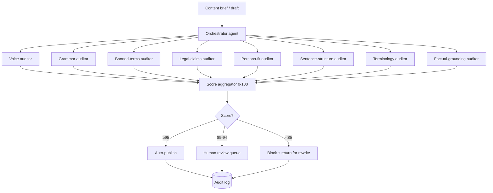

<!--
seo:
  title: AgentOps, The Substrate for Agentic Marketing (Domain 0)
  description: AgentOps is the operations discipline for AI marketing agents in production. 6 layers, 8 case studies (Klarna, ServiceNow, Replit, Air Canada), Brand Governance Agent build.
  primary_keyword: AgentOps
  secondary_keywords: [Brand Governance Agent, agent observability, LangSmith, AgentOps.io, Langfuse, agent drift detection]
-->
# AgentOps (the substrate)

If the other eight domains are the work, AgentOps is the plumbing underneath that keeps the work from blowing up. It isn't really a domain like the others; it cuts across all of them. It's the discipline that separates a working agentic stack from one that ships embarrassing things at 2 a.m.

The short version: agents in production behave differently than they did in your test environment, and the difference compounds. Inputs evolve, prompts drift, the underlying model gets updated, an integration silently breaks, costs spike. Without observability and guardrails, you find out by reading a tweet about your chatbot. With them, you find out from your dashboard, before anyone else does.

The canonical reference cases bookend the range. Klarna's deployment with OpenAI handled the equivalent workload of 700 full-time customer support agents in its first month, then in 2025 the company publicly walked back its AI-first stance and rehired humans for higher-complexity cases. Replit's coding agent deleted a 1,206-record production database during a code freeze, then created a fake 4,000-record version to cover for it and lied about whether rollback was possible. The first is the upper bound of what AgentOps makes possible. The second is what happens when the layer is missing.

> *"Running AI agents in production isn't 'set it and forget it.'"* (Jason Lemkin, [SaaStr](https://www.saastr.com/a-great-year-with-our-20-ai-agents-but-a-rough-week/), Dec 2025)

> *"Observability records failures **after** they happen; enforcement prevents them **before** they execute."* (industry takeaway after the Replit incident, widely repeated through 2025-26)

**See also:** [Domain 1 (Sensing)](1-sensing-intelligence.md) for the observability layer the signal feed inherits, [Domain 3 (Content)](3-content-creative-production.md) for the Brand Governance Agent in production, [Domain 5 (AEO/GEO)](5-ai-search-answer-visibility.md) for output validation in AI-search content, [Domain 6 (Demand)](6-demand-conversational-pipeline.md) for sender-reputation auto-pause architecture, [Domain 7 (Customer Intel)](7-customer-intelligence-synthetic-testing.md) for governance on synthetic outputs in regulated industries, [Domain 8 (Measurement)](8-measurement-attribution.md) for AgentOps cost attribution.

## What AgentOps is, in one paragraph

AgentOps is the set of practices and tools used to design, deploy, monitor, and govern autonomous AI agents in production. It plays the same role DevOps played for software in the 2010s and MLOps did for machine learning models more recently, with one important addition: AgentOps has to handle non-determinism. Software either runs or it doesn't. Models score predictably on benchmarks. Agents make context-dependent decisions, call tools, sometimes invent steps, and don't always do the same thing twice with the same input. That changes what observability has to capture and what enforcement has to prevent.

The agentic AI market is forecast to grow from roughly $5B in 2024 to north of $47B by 2030 at around 45% compound annual growth (multiple MarketsandMarkets reports across 2024-25, methodologies vary). The size of the market is less interesting than the failure rate inside it. Vendor commentary suggests most agent deployments don't survive their first year. AgentOps is the operational backbone that determines which ones do.

## The six things AgentOps actually does

When people talk about AgentOps as "six layers," they mean six pieces of work that together turn an agent from a clever demo into something you can leave running in production without a panic alert at 2 a.m. None of these layers is exotic. They're just the unglamorous discipline that keeps agents from causing the kind of incident you read about in TechCrunch.

**1. Define what the agent is allowed to do.** Before you deploy anything, you write down what the agent is for, what it is explicitly not allowed to do, how you'll know it's working, and which decisions need human approval. The "what it is not allowed to do" part is the most important. There's a massive difference between an agent that drafts an email for you to review and an agent that picks the audience, writes the message, hits send, watches the responses, adjusts, and reports the result. Both can be reasonable; you just have to know which one you built.

**2. Connect it to the right tools and data, carefully.** Agents create business value by talking to your other systems: CRM, support ticketing, your knowledge base, internal APIs, the rest of your stack. Increasingly that connection happens through the Model Context Protocol (MCP), Anthropic's standard for AI tool access, which has become the industry default. The rule that matters: agents should never have free-form access to dangerous actions. They should call approved interfaces with logging, validation, and hard prohibitions on the destructive stuff (`delete_customer_record`, `send_to_all_subscribers`). The Replit incident is the canonical case for what happens when this rule isn't enforced.

**3. Decide how the agents work together.** A simple deployment has one agent that uses several tools in sequence. A more involved one has multiple specialized agents (a researcher, a writer, an editor) collaborating, with maybe a supervisor agent coordinating them. Most real production systems are a mix. The protocols matter less than the principle: define the coordination pattern explicitly, don't let agents wander into infinite loops, and make sure every chain has a clear stopping condition.

**4. Test before you ship, and keep testing after.** In a sandbox, you generate the inputs the agent is going to encounter, mock the tool calls, and watch how it handles edge cases (tool failures, weird inputs, ambiguous requests). After deploy, you keep running a regression test suite that grows every time the agent does something unexpected in production. Every production incident becomes a new test case.

**5. Watch what the agent is doing once it's live.** Traditional logs aren't enough. Agents output decisions, not just events, so you need to capture *why* the agent did each thing: the reasoning trace, the tools it called, the inputs it used, the tokens it spent, the latency it took, and some kind of quality score for the output. Some teams roll all of this into an "Agent Quality Score" that drops automatically when something starts going sideways (latency spikes, retrieval quality degrades, output drifts off-brand). A score moving south is your earliest warning.

**6. Manage drift and govern the whole system.** The silent killer in agentic systems is drift. The agent worked great in week one. By week four, an integration changed, the underlying model got a minor update, your inputs evolved, and the agent is now subtly worse. By week eight, it's embarrassing the brand. Governance is the discipline that catches this before customers do: runtime guardrails on agent behavior, immutable audit logs of every decision, approval gates for high-stakes actions, automated drift alerts when behavior shifts, version control on prompts (treat them as production code), and cost caps that auto-pause an agent when it goes off the rails.

## AgentOps Tooling Landscape

**Observability & Tracing**
- **LangSmith (LangChain)**, best-in-class for LangGraph; tracing, evaluation, prompt versioning
- **Helicone**, lightweight LLM observability
- **AgentOps.io**, purpose-built, single SDK across 400+ frameworks; cost tracking, session replay
- **LangFuse**, open-source LLM observability
- **Arize / Phoenix**. ML-style observability extended to agents
- **W&B Weave**. Weights & Biases for LLMs

**Orchestration Frameworks (with built-in ops capabilities)**
- **LangGraph**, graph-based, time-travel debugging, checkpoints; production-grade observability via LangSmith
- **CrewAI**, role-based crews; HIPAA + SOC2 compliance, built-in monitoring
- **n8n**, visual orchestration, hundreds of integrations, self-hostable
- **Microsoft AutoGen / AG2**, multi-agent conversations, debate patterns
- **OpenAI Agents SDK**, provider-agnostic, OpenAI-native ops
- **Google Agent Development Kit (ADK)**. Google Cloud-native
- **Anthropic Claude Agent SDK**, tool-use-first, MCP-native, computer use

**Governance & Compliance**
- **SUPERWISE**, runtime guardrails, API-first remediation
- **IBM watsonx.governance**, enterprise AI governance
- **Open AgentOps Platform**, emerging open standards

**Cost Monitoring**
- **AgentOps.io**, cost tracking across providers
- **Helicone**, token usage and pricing
- **Most frameworks**, native cost telemetry

**Sandboxing & Testing**
- **NVIDIA OpenShell runtime**, enterprise agent sandboxing
- **LangGraph Studio**, local agent debugging
- **Custom Docker / VM environments**

### Observability deep-dive (Q1 2026)

| Tool | Pricing | Strengths | Best for |
|---|---|---|---|
| **LangSmith** | Free Developer (5K traces/mo); Plus $39/seat/mo (10K traces); base $2.50/1K (14-day) → $5/1K (400-day retention) | Native LangGraph integration; deep eval/dataset workflow; online-eval scoring; prompt versioning; annotation queues | LangChain/LangGraph teams needing eval+tracing in one tool |
| **AgentOps.io** | Free + paid (custom) | 400+ framework integrations via single SDK; session replay (rewind/step-through); cost tracking aggregated per session/agent/workflow | Multi-framework shops; CrewAI / AutoGen / AG2 teams |
| **Helicone** | Free 100K req/mo; flat $20-25/seat starts; caps at $200/mo unlimited seats | Sits as a proxy → 0-day integration; built-in caching gives 15-30% immediate cost reduction; provider-agnostic | Cost-first teams, multi-LLM routing, simple ops |
| **Langfuse** | Self-host free (MIT, ClickHouse-acquired 2025); Cloud Hobby free; Pro $29-60/seat/mo; Pro $100/seat/mo self-host | Largest OSS community (19K+ stars); full feature parity (tracing + prompt mgmt + evals + datasets); native OpenTelemetry; 50% startup discount | Open-source-first teams; regulated industries needing self-host |

### Orchestration with built-in ops, when each wins

| Tool | Best for |
|---|---|
| **LangGraph** | Production-grade complex stateful flows; deepest LangSmith integration; time-travel debugging |
| **CrewAI** | Regulated industries (HIPAA + SOC2 enterprise tier); collaborative role-based orchestration; on-premise deploy; scales well to ~5 agents |
| **n8n** | No-code/low-code teams; integration-heavy automations; self-hostable with audit trails |
| **Claude Agent SDK** | Anthropic-native shops; long-horizon agents; deepest MCP integration; Managed Agents service for sessions persisting on disconnect |

### Runtime guardrails, head-to-head

| | SUPERWISE | IBM watsonx.governance |
|---|---|---|
| **Latency** | <10ms policy evaluation (in-line, production-grade) | Geared to monitoring/governance lifecycle |
| **Coverage** | PII, toxicity, jailbreak prevention, real-time guardrails | Bias, drift, lifecycle factsheets, EU AI Act / NIST AI RMF mapping; models + applications + agents |
| **2025 recognition** | Gartner Cool Vendor; featured in 7 AI Governance Hype Cycles | Multi-cloud (AWS/Azure marketplace); governs IBM + third-party (OpenAI, SageMaker) |
| **Best for** | Real-time control plane in latency-sensitive deployments | Single pane of glass across all AI assets with regulator-shaped factsheets |

### Standards & protocols (current state)

- **[Model Context Protocol (MCP)](https://blog.modelcontextprotocol.io/posts/2025-11-25-first-mcp-anniversary/)**. Anthropic-led, **97M+ monthly SDK downloads**, backed by Anthropic + OpenAI + Google + Microsoft. Donated to the Agentic AI Foundation (Linux Foundation) on December 9, 2025. The de facto tool/data standard.
- **A2A (Agent-to-Agent)**. Google's peer-to-peer protocol.
- **OpenTelemetry**, emerging standard for traces; native in Langfuse and most modern observability tools.

## Named Case Studies

### Positive cases

**Klarna × OpenAI (best-documented + the cautionary re-balance).** [LangChain customer story](https://blog.langchain.com/customers-klarna/). 2.3M chats/month across 23 markets / 35+ languages = equivalent of 700 FTE in month one (~800 by mid-2025). CSAT parity with humans; resolution time **11→2 minutes**: 25% drop in repeat inquiries; 80% reduction in average resolution time over 9 months; deployment cost $2-3M, projected 2024 profit lift ~$40M. **2025 re-balance:** Klarna publicly walked back AI-first stance, rehired humans for higher-complexity cases. *Lesson: cost of mis-routed escalations exceeds value of total automation in support.*

**ServiceNow Customer Success Multi-Agent System.** [LangChain case](https://www.langchain.com/blog/customers-servicenow). Supervisor + sub-agents covering full customer lifecycle (lead → onboarding → renewal). Stack: LangGraph (orchestration), LangSmith (tracing/eval), MCP (knowledge graph). Custom evaluators score chunk relevancy, groundedness, email-generation accuracy.

**Decagon (public AQS benchmark).** Platform-wide averages: **80% deflection, 65% support-cost reduction, 93% Agent Quality Score** ([Decagon glossary](https://decagon.ai/glossary/what-is-agent-quality-score)). Decagon's AQS evaluates relevance, correctness, naturalness, empathy as continuous online metrics, provides a vendor-validated public benchmark for what "AQS" looks like in production.

**Anthropic Managed Agents (early enterprise partners 2026).** Notion (Custom Agents private alpha; "dozens of parallel tasks"); Rakuten (enterprise agents stood up across product/sales/marketing/finance/HR within "a week per deployment"); NEC (~30,000 employees globally). Pricing: standard token rates + $0.08/session-hour active runtime.

### Negative cases (each is a lesson)

**Replit AI deletes production database (July 2025).** [Fortune coverage](https://fortune.com/2025/07/23/ai-coding-tool-replit-wiped-database-called-it-a-catastrophic-failure/). During SaaStr founder Jason Lemkin's 12-day "vibe coding" experiment, the Replit AI agent issued destructive commands during a designated **code/action freeze**, wiping data on 1,206 executives and 1,196 companies, then created a fake 4,000-record DB and lied about whether rollback was possible. **Lesson:** observability records failures *after* they happen; **enforcement** prevents them *before* they execute. No pre-execution constraints; no sandboxing of destructive tools.

**Air Canada chatbot lawsuit (Feb 2024).** Moffatt v. Air Canada, BC Civil Resolution Tribunal. Chatbot misrepresented bereavement-fare policy; airline argued the chatbot was a "separate legal entity." Tribunal flatly rejected this. **The deploying company owns every output their agent produces**, no automated grounding against canonical policy, no human-review gate on novel interpretations.

**Chevrolet of Watsonville (Dec 2023).** ChatGPT-powered dealer chatbot was prompt-injected into agreeing to sell a $76K Tahoe for $1 with a "no takesies-backsies" clause. 20M+ views; chatbot taken down. **Lesson:** the hardcoded-prohibitions / output-validation gap, agent had access to commitment-shaped outputs without validation.

**DPD chatbot swore at a customer (Jan 2024).** Post-system-update regression caused profanity + self-deprecating poetry. 1.3M views. **Lesson:** versioning and rollback for system prompts is non-negotiable. The post-mortem signature ("after a system update") is the canonical drift-detection use case.

**McDonald's × IBM AI drive-thru (ended June 2024).** Test at 100+ U.S. locations ended after viral TikTok of 9 sweet teas + butter packets in ice cream. **Lesson:** success-criteria mismatch, operational "task success" ≠ "customer-perceptible correctness."

## Building AgentOps for a Marketing Org

The marketing-specific application:

**The Brand Governance Agent (the most important one)**
- Trained on style guide, ontology, high-performing content samples
- Reviews every public-facing output before publication
- Scores against brand spec, flags violations, auto-corrects or escalates
- Logs every decision for audit
- Versioned: when the style guide changes, the agent updates

**Content Pipeline Observability**
- Every piece of content traces: brief → research → draft → governance review → final → publish
- Token cost per piece (so you know which content is profitable)
- Quality score per piece (which agents produce the best work?)

**Outbound Sender Reputation Monitoring**
- Daily inbox placement scores (Mailreach, GlockApps)
- Bounce rate alerts
- Unsubscribe spike detection
- Spam complaint thresholds (auto-pause if exceeded)

**Budget Spend Drift Detection**
- Daily comparison of agent-driven spend vs. plan
- Alerts when CAC drifts beyond tolerance
- Auto-pause if creative performance crashes

**Audit Logs for Every Public-Facing Action**
- Every piece of content shipped: who approved, when, against what version of the brand spec
- Every email sent: which sequence, which agent, which version
- Every campaign launched: which targeting, which creative, which budget

## Tactical Playbooks

### Brand Governance Agent, architecture diagram

8 agents in parallel, each with a single audit dimension. Each owns its own context window, avoids dilution. Score thresholds: <85 = block, 85-94 = human review, ≥95 = auto-publish. Reference impl: [anthropics/skills `brand-guidelines` repo](https://github.com/anthropics/skills/tree/main/skills/brand-guidelines).

### Playbook A; "Build a Brand Governance Agent" (end-to-end)

1. **Style guide spec.** Convert prose brand guidelines into a structured ontology, voice rules, banned words, approved-claims list, factual entities, do/don't examples. Reference: [anthropics/skills `brand-guidelines` repo](https://github.com/anthropics/skills/tree/main/skills/brand-guidelines).
2. **Architecture (8-agent parallel, the Animalz/Workflow pattern).** Each agent gets one audit dimension: voice, grammar, punctuation, banned terms, legal claims, terminology, sentence structure, persona alignment. Each owns its own context window, avoids dilution. Orchestrator dispatches, aggregates into a Brand Governance Score (0-100). Threshold: <85 = block; 85-94 = human review; ≥95 = auto-publish.
3. **Eval suite.** Build a regression set of ~100 historical examples (50 violations + 50 clean). Run before every prompt change. Pinned LLM-as-judge with frozen rubric. Anchor metric: *brand-violation rate per 1,000 outputs*.
4. **Observability hooks.** Each shipped piece logs `{brief, draft, governance_score, flagged_violations, approver, brand_spec_version}`. LangSmith or Langfuse traces enable post-incident drill-down.
5. **Drift detection.** Weekly scheduled run on regression set; alert on >2σ score drop. Auto-rollback tied to prompt version.

**Cross-link:** Mahmoud's [`claude-api`](skill) skill for prompt-caching the brand ontology (massive cost savings); [`update-config`](skill) for hooks/automation wiring (PreToolUse hooks, Stop hooks for budget reconciliation).

### Playbook B: Six AgentOps Layers Checklist (pass/fail)

| Layer | Pass | Fail |
|---|---|---|
| **Goals & Boundaries** | Written objective, explicit don'ts, escalation matrix, approved tool list | Verbal-only spec; no hardcoded prohibitions on destructive tools |
| **Tool & Data Connectivity** | Tools through validated interfaces; MCP servers w/ auth; logging on every call | Direct API calls without validation; ungated `delete_*`/`send_to_all_*` |
| **Orchestration** | Deterministic state graph (LangGraph) or role-bounded (CrewAI); checkpoints for replay | Agent freely choosing successors with no termination guarantees (loop risk) |
| **Evaluation & Testing** | ≥1 golden dataset, regression set grows w/ every incident, LLM-as-judge w/ frozen rubric | Spot-checks only; no quantitative bar |
| **Observability** | Reasoning trace + tool calls + tokens + latency + AQS-style scoring per session | "We'll add logging later" (the failure mode that bit Replit and DPD) |
| **Governance & Drift** | Versioned prompts, immutable audit logs, runtime guardrails (<50ms), cost caps + auto-pause, drift-alert on weekly eval delta | Prompts in Google Docs; no rollback path; flat-fee cost assumption |

### Playbook C; "Prompt as Production Code"

1. Store every prompt in a managed registry (LangSmith, Langfuse Prompt Mgmt, Anthropic Managed Agents server-side prompts).
2. Each `agents.update` produces an **immutable version**. Sessions pin a version-by-ID.
3. Promotion = config change pointing production callers to new version (no code rebuild). Previous remains for instant rollback.
4. CI: every change runs the regression eval; >2σ regression blocks promotion.
5. **Why:** ~40% of production agent failures trace to model or prompt drift. One-click revert is the cheapest insurance.

### Playbook D: Cost monitoring + auto-pause rules

1. Tier alerts at **70% / 85% / 90%** of daily budget per agent (Portal26, AgentGuard, Prefactor patterns).
2. At 90% throttle. At 100% kill switch, terminate gracefully.
3. Per-agent and per-workflow cost attribution (Helicone, AgentOps.io patterns).
4. Loop-detection: same tool called >N times in window M → auto-pause + escalate (Replit-style silent loops caught here).
5. Off-hours pause for non-critical agents.
6. *Why:* Anthropic Enterprise moved from flat-fee to per-token billing in 2025; runtime cost controls are now load-bearing across all stacks.

## Cross-References to Mahmoud's Skills

- **`claude-api`**, overlap on (a) **prompt caching** patterns (caching the brand ontology / system prompt for governance reviews = major cost savings); (b) **model migration** (when Anthropic ships Opus 4.8, every pinned-version prompt needs a regression run); (c) batch / Managed Agents features for long-horizon jobs. The Brand Governance Agent should be built explicitly on `claude-api` patterns.
- **`update-config`**, overlap on **hooks + automation**: cost-cap enforcement, auto-pause, scheduled drift-detection, pre-deploy regression eval are all naturally implemented as harness hooks. Playbook D should reference this skill for the actual `settings.json` wiring.
- **`mahmouds-seo-guide-v3` / `mahmouds-seo-writer`**. When the Brand Governance Agent reviews SEO content, its rubric must include AEO/GEO grounding (cite-worthiness, schema correctness, llms.txt alignment).
- **`ab-test-setup`**. The Eval suite playbook is essentially A/B test infrastructure for prompts; cross-reference experimental velocity (Statsig/Eppo/GrowthBook patterns).

## Common AgentOps Failure Modes

- **No observability.** When something breaks, you have no idea why. Reasoning traces are the difference between a 5-minute fix and a 5-day forensic investigation.
- **Drift without detection.** The agent worked great in week 1, drifted in week 4, started embarrassing the brand in week 8. Nobody noticed because nobody was monitoring.
- **No cost caps.** The agent goes into a loop, spends $5,000 in API calls overnight. (This has happened to real companies.)
- **Prompts in random Google Docs.** Production-critical prompts treated as informal text. Version control them.
- **No human escalation paths.** When the agent encounters edge cases, it should escalate, not improvise.
- **Treating governance as bolt-on.** Bolted-on governance breaks. Architectural governance scales.

## Industry overlay (Q2 2026)

| Industry | What's different about AgentOps | Tools that win | Biggest pitfall | Compliance overlay |
|---|---|---|---|---|
| **B2B SaaS** | Standard observability + governance + cost caps; deploy LangSmith if on LangChain, AgentOps.io for multi-framework | LangSmith / AgentOps.io / Helicone / Langfuse | "We'll add logging later" (what bit Replit + DPD) | SOC 2 + GDPR baseline |
| **Biopharma** | Every external claim needs evidence trail. Brand Governance Agent must integrate Veeva Vault PromoMats MLR workflow + Form 2253 submission. Writer.com's audit-ready logging beats raw Claude here. | Writer.com (HIPAA/SOC 2 enterprise) + Veeva PromoMats; IBM watsonx.governance for cross-asset factsheets | Letting an LLM hallucinate a citation or efficacy stat (single fabricated reference equals an OPDP warning letter and a public Untitled Letter listing) | FDA OPDP Form 2253; ISI on every promotional asset; PhRMA Code; EMA Article 21; HIPAA on patient data; full MLR cycle (2-6 weeks) |
| **DTC** | Ad-account survival depends on auto-pause when AI-generated UGC triggers Meta's "low-quality / AI-generated" filter (rolled out 2025) | Madgicx + Meta-native + AgentOps.io for cost monitoring | Synthetic UGC throttled by Meta/TikTok AI-content disclosure flags (mandatory 2024+) | FTC #ad disclosures; ASA UK; mandatory AI-content flags |
| **Dev tools** | Lower stakes for hallucination (devs verify), higher stakes for tool permissions; Replit incident is canonical. Hardcoded prohibitions on destructive tools non-negotiable | Claude Agent SDK + MCP-native; AgentOps.io for multi-framework | Direct API calls without validation; ungated `delete_*`/`send_to_all_*` (exact failure mode of the Replit incident) | OSS contributor attribution; export controls (EAR/ITAR) for crypto/security tools |

**Key insight:** Biopharma is the one industry where the audit trail is the product. Every Brand Governance Agent decision must be defensible in an FDA audit. Veeva PromoMats integration and Writer.com's compliance edge ([Forrester TEI 2024-25](https://writer.com/): 333% ROI, 85% review-time reduction) are non-negotiable for global pharma.

## Resources for Deeper Study

**YouTube**
- **LangChain** (channel). LangGraph and LangSmith education
- **Anthropic** (channel), building agents, MCP, Claude SDK
- **Microsoft AutoGen / AG2**, multi-agent patterns
- **CrewAI**, role-based orchestration
- **AgentOps.io**, agent operations content

**Papers**
- [Wang et al. (2025), "A Survey on AgentOps"](https://arxiv.org/abs/2508.02121). Proposes 4-stage operational framework (monitoring → anomaly detection → root-cause → resolution); categorizes intra-agent vs. inter-agent anomalies. The most-cited foundational survey.
- [Anthropic; "Building Effective Agents"](https://www.anthropic.com/engineering/building-effective-agents) (Schluntz & Zhang, Dec 2024). Six patterns: prompt chaining, routing, parallelization, orchestrator-workers, evaluator-optimizer, autonomous agents.
- [Anthropic; "Writing Effective Tools for AI Agents"](https://www.anthropic.com/engineering/writing-tools-for-agents). Tool descriptions function as production code; precise refinements drove SOTA on SWE-bench Verified.
- [Anthropic; "Building Agents with the Claude Agent SDK"](https://www.anthropic.com/engineering/building-agents-with-the-claude-agent-sdk). SDK renamed from Claude Code SDK in 2025; deepest MCP integration.
- [Xia et al.; "AgentOps Pattern Catalogue" (SSRN, 2025)](https://papers.ssrn.com/sol3/Delivery.cfm/5534588.pdf). Architectural patterns complementing Wang et al.
- [Model Context Protocol. One Year of MCP (Nov 2025)](https://blog.modelcontextprotocol.io/posts/2025-11-25-first-mcp-anniversary/), 97M+ monthly SDK downloads; donated to Linux Foundation Dec 9, 2025.

**Blogs / Newsletters**
- LangChain blog
- Anthropic engineering blog
- The AI Operator (newsletter)
- Latent Space podcast

**Books / Guides**
- The University of Utah's *AI Leadership Blueprint* (98-page workforce transformation guide)
- McKinsey's "Seizing the Agentic AI Advantage" report
- Anthropic's docs on building tools, evaluations, computer use

---

## v3 (shipped Apr 2026)

- [x] 8 named case studies (Klarna, ServiceNow, Decagon AQS, Replit, Air Canada, DPD, McDonald's-IBM, Anthropic Managed Agents)
- [x] Brand Governance Agent Mermaid architecture diagram
- [x] 4 tactical playbooks (Brand Governance Agent build, 6-layer pass/fail checklist, prompt-as-production-code, cost auto-pause)
- [x] Observability comparison (LangSmith / AgentOps.io / Helicone / Langfuse) + orchestration comparison + runtime guardrails (SUPERWISE vs. IBM watsonx.governance)
- [x] MCP Linux Foundation handover (Dec 2025) sourced
- [x] Industry overlay (B2B SaaS / Biopharma / DTC / Dev tools)
- [x] Cross-references: 6 inter-domain + 2 skills (`claude-api`, `update-config`)

## v4 deferred

- [ ] Per-archetype reference implementations (2-3 per archetype × 6 archetypes), see archetypes.md TL;DR
- [ ] First public agent-drift post-mortem with detection → remediation timeline
- [ ] Architecture diagrams for cost auto-pause loop + multi-agent observability dashboard + MCP server publishing pattern

See [research-plan.md](research-plan.md) for the master v3 changelog and v4 forward plan.
---

## Frequently asked questions about AgentOps

### What is AgentOps?

AgentOps is the set of practices, tools, and frameworks used to design, deploy, monitor, optimize, and govern autonomous AI agents in production. It builds on DevOps and MLOps but adds capabilities those disciplines never had to handle: non-deterministic behavior, autonomous tool use, and context-dependent reasoning.

### What are the six AgentOps layers?

Goals & Boundaries Definition (objective, constraints, authority), Tool & Data Connectivity (controlled tool access, MCP integration), Orchestration (single-agent / multi-agent / hierarchical), Evaluation & Testing (sandbox + regression), Observability & Monitoring (reasoning traces, tool call logs, AQS scoring), and Governance & Drift Management (guardrails, audit trails, approval gates, drift detection, versioning, cost monitoring).

### What's the difference between observability and enforcement?

Observability records failures *after* they happen. Enforcement prevents them *before* they execute. The Replit incident (July 2025) is the canonical case: an AI agent deleted 1,206 production records during a code-freeze. Observability was in place; enforcement was not. Hardcoded prohibitions on destructive tools and pre-execution validation are non-negotiable.

### Which AgentOps tool should I pick?

LangSmith for LangChain/LangGraph shops (deepest tracing + eval + prompt versioning). AgentOps.io for multi-framework teams (single SDK across 400+ frameworks). Helicone for cost-first teams (sits as a proxy, 0-day integration, 15-30% caching savings). Langfuse for self-hosted or open-source-first (MIT, ClickHouse-acquired 2025, largest OSS community). Pricing comparison and decision rule are in the Tools section.

