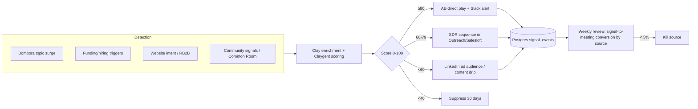

<!--
seo:
  title: Sensing & Intelligence, Multi-Source Signal Feeds for B2B (Domain 1)
  description: Convert market activity into structured signal feeds. Multi-source intent (6sense, Demandbase, Clay, Common Room) + named cases (Anthropic +3× enrichment, Semgrep +74% pipeline).
  primary_keyword: B2B intent data
  secondary_keywords: [multi-source signal feed, 6sense vs Demandbase, buyer intent, ABM signals, Clay GTM, Common Room]
-->
## Domain 1: Sensing & Intelligence

The outward-facing perception layer of the OS. Agents ingest signals from the outside world (accounts, competitors, customers, communities) and convert that raw activity into structured feeds the rest of the system can act on.

The work was always there. What changed is that monitoring at meaningful breadth used to require a team. Now a single operator can run continuous monitoring across thousands of accounts, dozens of competitors, and hundreds of communities, if the orchestration is set up correctly.

> *"They're anonymous, they're fragmented and they're resistant."* (Latané Conant, CRO, 6sense, [SaaStr Podcast #433](https://www.saastr.com/saastr-podcast-433-with-6sense-cmo-latane-conant-what-it-really-takes-to-have-your-marketing-team-deliver-pipeline-and-revenue/))

**See also:** [Domain 6 (Demand)](6-demand-conversational-pipeline.md) for routing and SLA enforcement once signals fire, [Domain 0 (AgentOps)](0-agentops.md) for the observability layer the signal feed inherits, [Domain 2 (Strategy)](2-strategy-positioning.md) for sales-call mining as positioning research, [Domain 5 (AEO/GEO)](5-ai-search-answer-visibility.md) for tracking which AI models cite you when buyers research your category.

### Why this matters now

The most useful single statistic is from [6sense's 2025 Buyer Experience Report](https://6sense.com/science-of-b2b/buyer-experience-report-2025/), based on a survey of 4,000-plus B2B buyers across North America, Europe, and Asia-Pacific. 94% of buying groups have already ranked their preferred vendors before talking to sales, and 77% end up buying from that preliminary favorite. 95% of buyers select from the four vendors on their "Day One Shortlist," up from 85% the prior year. The buying journey shifted from a 70/30 to a 60/40 split between research and seller engagement year over year. 89% of purchases now include an AI feature requirement, with 58% of buyers engaging sellers earlier specifically to clarify AI implementations. Buying cycles compressed roughly from 11 to 10 months.

The implication is brutal for any company that isn't visible during the research phase: by the time a buyer talks to your sales team, the decision has already been mostly made.

The intent-data market reflects this. Aggregator forecasts (DataIntelo, Verified Market Research) put it at roughly $3.79B in 2026 growing to $4.43B in 2027, around 16% compound growth. But intent data alone is a baseline. The teams winning combine topic-level intent with the full spectrum of buying signals, job changes, funding events, hiring patterns, SEC filings, leadership changes, competitive intelligence, and route those signals into action automatically. False-positive rates on single-source intent run between 25 and 50% (NetLine 2024 found 25% of intent surges produce no buying activity within six months), so combining at least two independent sources is the standard fix.

### Six kinds of signal worth tracking

The work in this domain is to gather signals from six different places and turn them into a single feed your team and your agents can act on. Most teams track one or two of these and miss the rest.

**Account intent.** Are specific companies in your target list researching your category right now? Three different sources tell you something here: who is on your own website (first-party), who is reading category-specific content across the broader web (third-party intent providers like Bombora), and who is being targeted by other companies' ads in your category (bidstream data). No single source is reliable on its own. Combined, they give you a usable signal.

**Firmographic and lifecycle events.** A company just raised a Series C. Their VP of Data left. They posted twenty new engineering job openings. They opened an office in Berlin. Each of these is a buying signal for someone. A sudden VP of Data hire, for example, is a strong leading indicator for data tooling purchases. The trick is connecting the right event to the right offer.

**Competitive intelligence.** What are your competitors changing on their pricing pages, what are they shipping, who are they hiring, what are they emphasizing in their messaging this quarter? Most of this is public if you bother to watch it weekly.

**Industry and macro signals.** Regulatory updates, analyst reports (Forrester, Gartner, IDC), conference talks, pre-print papers in research-heavy categories. The signals that tell you the wind is shifting before everyone else notices.

**Customer signals.** Sales call transcripts (Gong, Chorus, Fireflies do this), support tickets, NPS commentary, churn-survey free text, customer interview transcripts. This is the most under-mined source on most teams. Your customers are telling you exactly what they want, in their own words, in transcripts most people never read.

**Community and social signals.** LinkedIn conversations, Reddit, niche forums, Discord and Slack communities, podcast mentions, X, Bluesky, Threads. The hard part is filtering. The easy part is that the data exists.

### What works in 2026

**Combine at least three signal sources before you act.** Single-source intent has a 25 to 50 percent false-positive rate (NetLine 2024 found that a quarter of intent surges produce no buying activity within six months). When intent, a funding event, and a leadership change all fire on the same account inside thirty days, that's a real signal worth investing in. A topic surge alone is barely a hint.

**Match the platform to the stack you actually run, not the one you wish you had.** 6sense and Demandbase install managed packages with custom Salesforce objects, take weeks to configure, and need dedicated RevOps headcount. Apollo, Warmly, and the lighter platforms write into your existing CRM objects via API in days. The right answer depends on your CRM scale and your ops headcount, not on which vendor's deck looks better.

**Capture sales call transcripts and route them into your strategy work.** This is the single highest-leverage move most teams miss. Transcripts contain the exact language buyers use, better positioning research than any external panel could give you, available for free if you already use Gong, Chorus, or Fireflies.

**Build a structured signal feed, not another dashboard.** Dashboards are for humans to read. Signal feeds are for the rest of the OS to consume. The output of this domain should be a stream that the demand and pipeline domain can act on automatically without anyone clicking through a Looker chart.

### Tools & Platforms (2026)

**Enterprise Intent Platforms (full-stack)**
- **6sense**: $50,000-$150,000+/yr. Three-layer intent (1st party + 3rd party + bidstream). Best for mature ABM orgs with dedicated RevOps. 3-6 month implementation.
- **Demandbase**: $40,000-$120,000+/yr. Embeds Bombora data + own signals. Strongest for ABM orchestration + advertising integration.
- **ZoomInfo**: $25,000-$60,000/yr with intent add-on. Largest contact database, intent via Bombora partnership. Better for outbound prospecting than ABM orchestration.

**Cooperative / Topic Intent**
- **Bombora**: $25,000-$75,000/yr. Cooperative network of 5,000+ B2B sites, Company Surge methodology. Pure data layer; pair with execution tools.

**Mid-Market Platforms**
- **Cognism**. Strong EU compliance, integrates Bombora data. Best for European GTM motions.
- **Apollo.io**. From $49/user/month. Contact data + intent + sequencing + dialer. Most accessible all-in-one.
- **Warmly**. Real-time website intent + visitor identification + outbound orchestration.
- **LeadIQ**. Mid-market SDR tooling with intent built into prospecting workflow.

**Specialized**
- **Common Room**. Community signals (Slack, Discord, GitHub, Reddit). Best for PLG companies.
- **UserGems**. Job-change tracking ("your champion just moved to a new company").
- **Clearbit (now HubSpot Breeze Intelligence)**. Visitor identification + enrichment.

**Sales Intelligence / Conversation Intelligence**
- **Gong**. Sales call analytics, deal intelligence
- **Chorus.ai** (ZoomInfo). Conversation intelligence
- **Fireflies.ai**. Note-taking + analytics
- **Modjo**. European-strong alternative

**Custom Stack (the agentic approach)**
- **Clay**. Programmable enrichment + Claygent (AI research agent). $134-$720+/month. The "GTM engineer's choice." Anthropic and OpenAI both run Clay as primary infrastructure (see case studies). Steep learning curve.
- **n8n / LangGraph custom workflows**. Build your own monitoring stack with web scraping, RSS, API calls, LLM enrichment.

#### 2026 enterprise ABM platform comparison ([Vendr median ACV data](https://www.vendr.com/))

| Platform | Median annual contract | Best for | Implementation | Switching cost |
|---|---|---|---|---|
| **6sense** | **$58K/yr** (range $35K to $130K+) | Mature ABM with dedicated RevOps; predictive AI is strongest in class. Signalverse processes 1T+ signals/day | 3 to 6 months (custom SFDC package, custom objects) | High; custom SFDC objects mean migration is painful |
| **Demandbase** | **$66K/yr** (range $50K to $150K+) | Best when ABM orchestration + advertising are tightly coupled; highest Forrester scores on signal volume + partner ecosystem | 2 to 4 months | High; similar SFDC depth |
| **ZoomInfo** | **~$15K to $30K/yr** for most mid-market plans; enterprise $30K+ | Largest contact database; intent via Bombora; better for outbound prospecting than ABM orchestration | 2 to 6 weeks | Medium; writes into standard SFDC objects |

[Forrester Wave Q1 2025 Leaders](https://6sense.com/forrester-wave-b2b-intent-data/): Intentsify, 6sense, Bombora, Informa TechTarget, Demandbase. Demandbase received highest possible scores on signal volume + integration + partner ecosystem; 6sense called out as "among the most innovative players."

#### Mid-market / GTM-engineering tier

| Platform | Pricing | Sweet spot |
|---|---|---|
| **Apollo.io** | From $49/user/mo | All-in-one (data + sequencing + dialer); best out-of-the-box value for SMB/early-mid-market. $150M ARR (May 2025), 50K+ weekly active users |
| **Clay** | $134-$720+/mo (workspace + credits) | The "GTM engineer's choice." $100M ARR (Aug 2025), $1B+ valuation. Anthropic + OpenAI both run Clay as primary infra |
| **Cognism** | Custom, typically $8K-$15K/yr for growing teams | EMEA/UK strength; **Diamond Data** mobile numbers reported at 98% accuracy; GDPR-first. The default for European GTM |

**Practitioner allocation pattern (cited in 2026 reviews):** Apollo for engagement (~40% of workflow), Clay for enrichment/custom signals (~35%), Cognism for compliance-sensitive or EMEA targeting (~25%).

#### PLG / community signal

- **Common Room**. Starter **$1,700/mo** (annual; 35K contacts); enterprise contracts typically **$50K-$80K+/yr.** G2 4.5/5 across 106 reviews. Best-in-class for community-led GTM (GitHub, Slack, Discord, Reddit, X).

### Named Case Studies

| Case | What they did | Result | Source |
|---|---|---|---|
| **Anthropic + Clay** (Adam Wall, Head of Sales Ops) | Replaced entire enrichment-vendor stack with Clay + Claude-powered custom lead-scoring fields | **3× enrichment coverage**, 4 hrs/week saved on SFDC opportunity upserts, consolidated/canceled top legacy data-provider contract | [Clay case](https://www.clay.com/blog/anthropic-case-study) |
| **OpenAI + Clay** (Keith Jones, GTM Systems Lead) | Inbound enrichment via Clay's multi-provider waterfall + OpenAI models for inferred fields | Enrichment coverage **low-40% → high-80%** | [Clay case](https://www.clay.com/blog/openai-case-study) |
| **Notion + Common Room** | PLG signal aggregation + scoring | **30% more meetings per rep per month**: SDRs saved **5× time** vs. tool-hopping; 2-3× propensity-to-buy lift on signal-scored prospects | [Common Room](https://www.commonroom.io/customers/notion-customer-intelligence-more-meetings-per-rep/) |
| **Semgrep + Common Room** | Cold → warm outbound transformation via signals (LinkedIn engagement, GitHub stargazers, Slack joiners) | **+74% pipeline contribution from outbound in a single quarter**; **2.5× ROI in <90 days** | [Common Room](https://www.commonroom.io/customers/semgrep-warm-outbound-grow-pipeline/) |
| **LeanIX + UserGems** (champion tracking) | Job-change signals from departing champions | **$800K pipeline within 6 weeks** | [UserGems](https://www.usergems.com/blog/champion-tracking) |
| **Cobalt + UserGems** (champion tracking) | Champion who moved to new role; BDR receipt | **$90K deal closed in 3 weeks** vs. typical 5-6 month enterprise cycle | [UserGems](https://www.usergems.com/blog/champion-tracking) |

**False-positive cautionary data ([MarTech 2024](https://martech.org/the-false-allure-of-b2b-intent-data/)):** SDR teams chasing topic surges report that **72% of signals rarely convert to meetings**, **64% feel they are "chasing signals" rather than working real opportunities**, and **25% of intent surges produce no buying activity within 6 months.**

### Tactical Playbooks

#### Multi-source signal feed, architecture diagram

#### Playbook A. Multi-source signal feed with Clay + n8n

**Goal:** combine 3+ independent intent signals into one structured queue that fires SDR + AE plays automatically.

1. **Detection layer (Clay).** Configure Clay tables for: (a) topic surge. Bombora API or G2 buyer intent; (b) firmographic triggers, funding/hiring/leadership change via Clay's enrichment providers; (c) first-party, website visits via RB2B / Vector / Warmly; (d) community. GitHub stars, Slack joins, LinkedIn engagement via Common Room webhooks or Clay's HTTP enrichments.
2. **Score layer (Claygent + Claude).** A Claygent column scores each row 0-100 based on (signal recency × signal strength × ICP match × buying-stage classifier). Claude as the LLM inside Clay for qualitative classification.
3. **Routing layer (n8n).** Webhook from Clay → n8n receives signal → conditional routing: `score ≥80` → AE-direct play with Slack alert; `60-79` → SDR sequence in Salesloft/Outreach; `<60` → nurture LinkedIn ad audience or content drip; null/<40 → suppress for 30 days.
4. **Suppression layer.** n8n maintains a key-value store per account with last-action timestamp + 30-day cooldown.
5. **Observability.** Every n8n node writes to Postgres / BigQuery `signal_events` table; weekly review = signal-to-meeting conversion by source. *Kill any source under 5%.*

#### Playbook B. Sales call transcript → positioning research

1. **Source.** Use [Fireflies' Claude MCP connector](https://fireflies.ai/blog/fireflies-claude/) (released 2025) or open-source Gong MCP server (`get_recent_calls`, `get_transcript` tools). Avoids the export-paste loop.
2. **Claude Project setup.** Three artifacts: (a) ICP definition; (b) competitor list; (c) "language we're looking for" prompt template.
3. **Per-call extraction prompt:** "Extract every direct quote where the buyer described (a) the pain they were solving, (b) tools they were comparing, (c) buying-committee dynamics, (d) objections. Tag each quote with stage and persona."
4. **Aggregation (quarterly):** "Given these 200 tagged quotes, identify the top 5 phrases competitors use to position against us, and the top 5 phrases buyers use to describe our wedge."
5. **Output → strategy + content.** Quote library feeds Domain 2 (positioning), Domain 3 (content briefs), Domain 5 (AEO-targeted language).

Reported productivity: **5-8 hours/week saved** on pipeline + coaching analysis when used by sales managers.

### Cross-References to Mahmoud's Skills

- **`customer-research-playbook`**, owns the *interview / JTBD* methodology side. Domain 1's call-transcript playbook is the *operational feed*; the playbook is the *research methodology*. Don't duplicate.
- **`competitor-research-playbook`**, competitive intelligence sub-domain (1.3) feeds raw signals; the playbook governs synthesis into battle-cards and positioning shifts.
- Forward-link to **Domain 6** for routing/SLA enforcement once a high-score signal fires.
- Forward-link to **Domain 0 (AgentOps)** for observability + cost-cap layer the signal-feed architecture inherits.

### Notable Practitioners & Frameworks

- **Latané Conant (formerly 6sense)**. Pioneered the "no-form, no-spam, no-cold-call" ABM motion. Her playbook on buying-stage classification is canonical.
- **Sangram Vajre (Terminus, GTM Partners)**. ABM evangelist; "MOVE" framework (Markets, Operations, Velocity, Expansion).
- **Chris Walker (Refine Labs / Passetto)**. Pioneered the "dark social" framing and the "self-reported attribution" approach to capturing intent that traditional analytics miss.

### Common Failure Modes

- **Signal fatigue.** Without filtering, 1,000 daily signals just becomes noise nobody reads. Enforce signal scoring + suppression.
- **Acting on false positives.** Ignoring the surge baseline creates wasted SDR cycles and damaged sender reputation.
- **Buying activation tools before fixing the foundation.** A $60K/year ABM platform produces no pipeline if your CRM has no clean account structure and attribution is still last-touch. Instrument before you activate.
- **Treating intent as the answer.** Intent tells you who's looking. It doesn't tell you why, what they need, or whether you fit. Treat intent as the trigger to do the research, not the conclusion.

### KPIs

- **Signal volume** (per account, per period)
- **Signal-to-meeting conversion rate**, the only metric that matters
- **False positive rate** by signal source
- **Time-from-signal-to-action** (target: <24 hours for high-quality signals)
- **Coverage**; % of total addressable accounts being monitored

### Industry overlay (Q2 2026)

| Industry | ICP / motion difference | Tools that win | Biggest pitfall | Compliance overlay |
|---|---|---|---|---|
| **B2B SaaS** | Topic intent + funding/hiring on 200-2K named accounts; champion-tracking via UserGems | 6sense + Clay + UserGems + Common Room (PLG); Apollo for SMB | Buying a $60K+ ABM platform before CRM hierarchy is clean (produces noise at scale) | SOC 2 / GDPR baseline |
| **Biopharma** | Signals are scientific events (Phase II readouts, NEJM/Nature pubs, KOL appointments, ASH/ASCO abstracts), not funding rounds. 12-18 mo cycles | Veeva Link + Clarivate Cortellis + Komodo Health for HCP/KOL graphs; PubMed/bioRxiv RSS into Clay; IQVIA/Evaluate Pharma | Treating Bombora as primary; biopharma buyers don't surge on G2 topics, they read journals | Sunshine Act on KOL outreach; HIPAA if patient-level data; GxP audit trail on signal-to-action |
| **DTC** | Signal is consumer trend velocity (TikTok sounds, Google Trends, retail-shelf), not account-level intent | Particl + Trendalytics + TikTok Creative Center + Glimpse + Triple Whale Sonar; Browse AI for SKU/price scraping | Chasing viral trends without inventory or fulfillment readiness | CCPA/CPRA + state biometric laws; ad-platform brand safety |
| **Dev tools** | Signal is GitHub stars/forks, npm downloads, Stack Overflow questions, Discord joins, llms.txt fetches, technical job postings | Common Room (best-in-class), OSS Insight, Clearbit reveal on docs traffic, GitHub Archive via BigQuery | Equating stars with intent (vanity metric). Filter by "PR closed in last 90 days" or "issue activity" | OSS license disclosure; trademark/brand dilution from forks |

**Key insight:** Biopharma sensing is fundamentally a *scientific publishing* and *KOL graph* problem. Bombora-class B2B intent is largely useless. BenchSci's reported 9-of-top-10 pharma footprint operates against publication data and HCP networks, not topic surges.

### Resources for Deeper Study

**YouTube channels**
- **6sense** (channel). Buyer experience research, intent data education
- **Demandbase** (channel). ABM orchestration, account-based playbooks
- **Refine Labs / B2B Revenue Vitals** (Chris Walker). Dark social, demand creation vs. demand capture
- **Common Room**. PLG and community-led signal capture

**Podcasts**
- *B2B Revenue Vitals* (Chris Walker)
- *Sangram Vajre's Take Command* (GTM Partners)
- *Topline* (Sam Jacobs, Pavilion)

**Frameworks worth learning**
- 6sense Buying Stage Classification (5-stage model)
- Demandbase Account Engagement Score
- Bombora Company Surge methodology

**Books**
- *No Forms. No Spam. No Cold Calls.* (Latané Conant)
- *MOVE: The 4-Question Go-to-Market Framework* (Sangram Vajre)

---

## v3 (shipped Apr 2026)

- [x] 6sense 2025 Buyer Experience Report integrated (94% / 77% / 95% Day One Shortlist)
- [x] Forrester Wave Q1 2025 Intent Data Providers (Intentsify, 6sense, Bombora, Demandbase as Leaders)
- [x] Vendr median ACV pricing (6sense $58K / Demandbase $66K / ZoomInfo $15-30K)
- [x] 6 named cases (Anthropic+Clay 3× enrichment, OpenAI+Clay 80%+ coverage, Notion+Common Room 30% more meetings, Semgrep+Common Room +74% pipeline, LeanIX+UserGems $800K, Cobalt+UserGems $90K in 3 weeks)
- [x] Multi-source signal feed Mermaid diagram
- [x] 2 tactical playbooks (Clay+n8n architecture, Gong/Fireflies → positioning research)
- [x] False-positive cautionary data (NetLine 2024: 25% of intent surges produce no buying activity)
- [x] Industry overlay (4 industries) + cross-references (6 inter-domain + 2 skills)

## v4 deferred

- [ ] LLM-visibility intent tooling deep-dive as the category forms (Q4 2026 candidate)
- [ ] 2-3 more biopharma cases (KOL graph, Veeva Link, Komodo Health) for biopharma overlay enrichment

See [research-plan.md](research-plan.md) for the master v3 changelog and v4 forward plan.
---

## Frequently asked questions about sensing and intelligence

### What is a multi-source signal feed?

A structured data stream combining 3+ independent buyer signals: topic intent (Bombora/G2), firmographic triggers (funding, hiring, leadership changes), first-party website activity (Warmly/RB2B), and community signals (Common Room for GitHub/Slack/Discord). Single-source intent has 25-50% false-positive rates per NetLine 2024 data; combining sources is the standard fix.

### How much do enterprise intent platforms cost in 2026?

Vendr median ACV (annual contract value): 6sense $58K/yr (range $35-130K+), Demandbase $66K/yr (range $50-150K+), ZoomInfo $15-30K/yr for most mid-market plans. Implementation: 6sense and Demandbase are 2-6 months with custom Salesforce objects; ZoomInfo writes into standard objects in 2-6 weeks. Common Room (PLG/community) starts at $1,700/mo.

### How does this work for biopharma sensing?

Biopharma signals are scientific events (Phase II readouts, NEJM/Nature publications, KOL appointments, ASH/ASCO abstracts), not funding rounds. Bombora-style topic intent is largely useless. The biopharma sensing stack is Veeva Link + Clarivate Cortellis + Komodo Health for HCP/KOL graphs, plus PubMed/bioRxiv RSS feeds piped into Clay. BenchSci's reported 9-of-top-10 pharma footprint operates against publication data and HCP networks, not topic surges.

### What's the most underused signal source?

Sales call transcripts. Tools like Gong, Chorus, and Fireflies capture the exact language buyers use to describe pain, alternatives, and triggers, which is better positioning research than any external panel. Pipe transcripts into a Claude Project with an extraction prompt to surface verbatim phrases for content, positioning, and AEO/GEO targeting.

