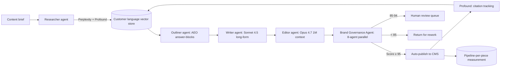

<!--
seo:
  title: Agentic Content Production Pipeline, From Brief to Citation (Domain 3)
  description: End-to-end agentic content pipeline (LangGraph + Claude Skills). Jasper vs Writer vs Custom Claude TCO, 7 named cases (Anthropic 30 min to 30 sec, Brand.ai, SAP $23M).
  primary_keyword: agentic content production
  secondary_keywords: [AI content pipeline, Jasper vs Writer, LangGraph content, Brand Governance Agent, AEO content brief]
-->
## Domain 3: Content & Creative Production

The highest-velocity and highest-brand-risk domain. This is the daily output of the function: long-form pieces (whitepapers, technical blogs, research reports, ebooks), short-form (social posts, ad creative, email copy, landing pages), multimedia (video scripts, podcast briefs, webinar outlines, slide decks), sales enablement (one-pagers, battlecards, pitch decks, ROI calculators), and visual and design assets.

Agents do most of the production. Humans set the strategy, refine the taste, and own the brand-integrity calls. The Brand Governance Agent from Domain 2 is the rate-limiter on quality.

> *"Slop is generated. Craft is built and made."* (Ann Handley, [*What's In/What's Out in 2025*](https://www.marketingprofs.com/articles/2025/52534/whats-in-whats-out-in-2025-marketers-version), MarketingProfs)

> *"Content operations is everyone following their own playbook. Content orchestration is everyone following the same playbook."* (Robert Rose, [*Content Orchestration: The 2026 Marketing Shift*](https://contentmarketinginstitute.com/strategy-planning/content-orchestration-vs-operations), CMI, Nov 17, 2025)

> *"AI has become a justification to not replace people who leave."* (Robert Rose, [*The Ghost Workforce*](https://www.imnewswatch.com/2026/04/07/the-ghost-workforce-how-ai-is-reshaping-content-and-marketing-roles-in-2026/), Apr 7, 2026)

**See also:** [Domain 0 (AgentOps)](0-agentops.md) for the Brand Governance Agent that gates every output, [Domain 2 (Strategy)](2-strategy-positioning.md) for the brand voice spec the pipeline consumes, [Domain 4 (Distribution)](4-distribution-channel-operations.md) for atomization at scale (one webinar into nineteen artifacts), [Domain 5 (AEO/GEO)](5-ai-search-answer-visibility.md) for AEO-first content briefs that earn LLM citations, [Domain 8 (Measurement)](8-measurement-attribution.md) for pipeline-per-piece measurement.

### Why this matters now

Two things changed at the same time, which is what makes this domain volatile.

The first is velocity. McKinsey's [April 2026 report on agentic marketing workflows](https://www.mckinsey.com/capabilities/growth-marketing-and-sales/our-insights/reinventing-marketing-workflows-with-agentic-ai) shows content cycles running up to four times faster with end-to-end agentic workflows, and projects agentic AI will power up to two-thirds of current marketing activities with roughly 15× faster campaign creation. [Jasper's State of AI in Marketing 2026 survey](https://www.jasper.ai/blog/state-of-ai-marketing-2026) (n=1,400) found AI adoption at 91%, up from 63%, and 95% planning to increase AI spend.

The second is that the wheels come off more often. ROI confidence in the same Jasper survey dropped from 49% to 41%. Governance blockers rose 3.4× year-over-year, becoming the new bottleneck. Only 19% of teams plan to hire content engineers despite scale being the top stated priority. The leadership-execution gap is stark: 61% of CMOs are confident in AI ROI versus 12% of individual contributors.

The performance numbers tell the same story. A five-month study by Neil Patel's NP Digital (replicated by Samwell.ai in 2025) found fully human-written content generates 5.44× more organic traffic than unedited AI content. [Semrush's research](https://www.semrush.com/blog/does-ai-content-rank-in-search-data-study/) shows hybrid AI plus human content reaches 94% brand consistency versus 87% for pure AI and 73% for pure human, ranks 34% higher than pure AI, and is 40 to 60% faster and 30 to 50% cheaper than conventional production. 62% of high-performing teams use the hybrid approach. 39% of content workflows now enforce "no AI content goes out without human review."

The lesson is simple: AI velocity without human taste produces content that doesn't perform.

There's a second structural shift, covered in detail in Domain 5: the audience for content has expanded. You're now writing for both humans and for the LLMs that will train on, retrieve, and cite your content. Production has to satisfy both readers.

### Six kinds of work that live inside content

The work breaks into six rough piles. Most teams underinvest in the last two.

**Long-form content** is the slow, durable stuff. Pillar pages, technical blog posts, research reports, whitepapers, ebooks, case studies, industry essays. The pieces that compound over years and that AI search systems are most likely to cite.

**Short-form content** is the daily output. LinkedIn posts, ads, email copy, landing page text, the small UI strings ("microcopy") inside the product itself.

**Multimedia** is video scripts, podcast briefs, webinar outlines, slide decks, conference talks, ads. Higher production cost per piece, higher attention return.

**Sales enablement** is the material your sales team uses to close deals: one-pagers, battlecards, vertical-specific pitch decks, ROI calculators, demo scripts, post-meeting email sequences. Often invisible to marketing leadership and often the highest-leverage thing the function produces.

**Visual and design** is the output of an art department: illustrations, social cards, photo composites, video edits, motion graphics, the templates that make everything look like one company.

**Repurposing and content operations** is the engine that takes one piece and turns it into many. A webinar that becomes eight LinkedIn posts, a blog, and five emails. A research report that becomes a podcast appearance, a Twitter thread, a sales deck, and an analyst briefing. With agents, this is now nearly free, which means most teams' real bottleneck is taste, not production.

### What works in 2026

**Run every output through a Brand Governance Agent before it ships.** This is non-negotiable in any agentic content stack. The agent is trained on your highest-performing existing content, your full style guide, your dictionary of preferred and banned terms, and examples of mistakes you've corrected before. Its job is to score every output against the brand spec, flag the violations, and either auto-correct them or push the piece into a human review queue. Without this gate, you ship 1,000 pieces a month and 600 of them sound like generic SaaS marketing wrote them, which is what's happening at most teams already.

**Route between models instead of picking one.** Different models have different strengths. Claude tends to be strongest for long-form and technical writing. GPT works well for general flexibility and ad copy. Gemini handles multimodal cleanly. Platforms like Jasper route between models internally, and custom stacks should do the same.

**Treat content as a distribution problem, not a creation problem.** Most content failures aren't "we didn't write enough." They're "we wrote in formats and on topics that don't compound." Atomize aggressively: one webinar should produce fifteen-plus artifacts across formats. The marginal cost of repurposing with agents is close to zero; the marginal cost of writing a brand-new pillar piece is real.

**Start from how AI search answers the question.** Teams using "research-first" workflows, where they look at how ChatGPT, Claude, and Perplexity currently answer the target question, find the gaps in those answers, and then write content that fills the gaps, reportedly see roughly three times the citation rate of teams using traditional keyword research alone. This is content engineering for the AI search era; see Domain 5 for the full picture.

**Capture customer language verbatim and feed it into the pipeline.** The single most underused asset in any content team is the language your customers already use. Mine your support tickets, sales call transcripts, NPS comments, and reviews for verbatim phrases. Generic AI content sounds like a marketer wrote it. Good content sounds like the customer wrote it.

**Optimize for completeness, not length.** AI search systems prefer content that answers a question fully and clearly. They don't reward hitting a word count. Short and definitive beats long and meandering.

### Tools & Platforms

**Marketing-Specific AI Content Platforms**
- **Jasper**: $49-$69+/user/mo + custom enterprise. Brand voice training (Jasper IQ), multi-model routing, governance, agent workflows. Best for marketing teams of 3-10. Customers include Wayfair, Boeing, L'Oreal, Cox Media, HarperCollins.
- **Writer.com**. Enterprise governance-first; style guide enforcement, terminology management, audit-ready. Best for regulated industries.
- **Copy.ai**. Workflow-focused, multi-step content generation
- **Marketing Mary**. Long-form blog automation pipeline
- **Anyword**. Performance prediction on copy

**General-Purpose LLMs (often the right answer for skilled operators)**
- **Claude (Anthropic)**. Strongest for long-form, technical, academic writing. Projects feature for brand context. Cowork (now expanding via plug-ins) for agentic workflows.
- **ChatGPT (OpenAI)**. General flexibility, multimodal, plugins
- **Gemini (Google)**. Multimodal-native, deep Google ecosystem integration
- **Perplexity**. Research-focused, citation-aware

**Visual & Design**
- **Midjourney v7+**. Highest-quality image generation
- **DALL-E 4 / Sora**. OpenAI's image and video gen
- **Runway**. Video generation, editing
- **Adobe Firefly + Adobe Express**. Brand-safe gen with commercial licensing
- **Canva Magic Studio**. Templates + AI gen for non-designers
- **Figma AI**. Design system integration

**SEO / Content Optimization**
- **Surfer SEO**. Real-time SEO optimization, integrated with Jasper
- **Clearscope**. Content optimization for traditional SEO
- **Frase**. Question-driven content briefs
- **MarketMuse**. Topic authority modeling
- **Sight AI**. AI-search optimization (citations across ChatGPT, Claude, Perplexity, Gemini)

**Repurposing & Content Ops**
- **Castmagic / Opus Clip**. Long-form video → shorts
- **Descript**. Editing audio/video like a doc
- **Repurpose.io**. Cross-platform distribution
- **Buffer / Hootsuite / Sprout Social**. Scheduling

**Custom Agent Stacks**
- **CrewAI**. Multi-agent content pipelines (researcher → outliner → writer → editor → QA). Reference: [crewAI-examples](https://github.com/crewAIInc/crewAI-examples) (Content Creator Flow). Pre-defined process structure; cleanest "out-of-the-box agent team."
- **LangGraph**. Stateful, controllable workflows with checkpoints + LangSmith observability. Reference: [langchain-ai/deepagents content-builder-agent](https://github.com/langchain-ai/deepagents/tree/main/examples/content-builder-agent) (21.8K stars). AGENTS.md (brand voice) + skills/ (workflow files) + subagents.yaml, mirrors Claude Skills filesystem pattern in LangGraph.
- **n8n**. Visual orchestration with hundreds of integrations. Best for connector-heavy glue.
- **Claude Code + Skills**. File-based markdown skills for repeatable workflows. Reference: [anthropics/skills public repo](https://github.com/anthropics/skills). Lowest TCO for solo operators / lean teams (a $20 Claude Pro seat + Skills repo competes with $25K/yr Jasper for 3-person teams).

#### Platform comparison (current 2025-26 pricing)

| Dimension | Jasper | Writer.com | Custom Claude (Skills + MCP) |
|---|---|---|---|
| Entry | $39-$59/seat/mo (annual) | $18-$29/seat/mo (Team, annual) | API: $3/M input, $15/M output (Sonnet 4.5); $15/$75 (Opus). No seat tax. |
| Enterprise | $1K-$2K/mo starting; $200-$500/seat/mo at 12-mo commit; large contracts ~$44K avg. **Up 46% YoY** | Mid-market $75K-$250K; enterprise $500K+ | Variable; one Claude Pro seat + Skills repo for lean teams |
| Brand governance | Brand Voice (auto-style enforcement), IQ models | **Strongest:** terminology mgmt, audit trails, automated compliance ([Forrester TEI 2024-25](https://writer.com/): 333% ROI, $12.02M NPV, 85% review-time reduction, payback <6 months) | Skills + AGENTS.md style guide + custom evals; needs build |
| Best for | 3-10-person marketing teams that want a UI | Regulated industries (finance, pharma, healthcare); audit-ready compliance | Engineering-adjacent marketing teams; lean teams; founders |
| Public customers | Wayfair, Boeing, L'Oréal, Cox Media, HarperCollins, [WalkMe](https://www.jasper.ai/case-studies/walkme), [2X](https://www.jasper.ai/case-studies/2x), [Pilot Company](https://www.jasper.ai/case-studies/pilot-company) | Qualcomm (2,400 hrs/mo saved), Vizient (4× ROI), Salesforce (20% productivity lift) | [Anthropic itself](https://claude.com/blog/how-anthropic-uses-claude-marketing); [Brand.ai (Lyft, Opendoor)](https://claude.com/customers/brand-ai) |

**Orchestration framework decision rule:** LangGraph for scale + observability; CrewAI for clean role orchestration; n8n for connector-heavy glue; Claude Skills for individuals/lean teams.

### Named Case Studies

| Case | What they did | Result | Source |
|---|---|---|---|
| **Anthropic's own growth marketing team** | Claude Code + Skills (brand tone, product accuracy, RSA best practices) + Figma plugin generating dozens of variants | Ad creation **30 min → 30 sec; 10× creative output**; one-person team output exceeds typical full marketing departments | [Anthropic blog](https://claude.com/blog/how-anthropic-uses-claude-marketing) |
| **Brand.ai (serving Lyft + Opendoor)** | Dual retrieval system on Claude (one for brand insights, one for conversation context); processes entire brand guidelines in one context window | Enterprise brand-compliance costs **$5M/yr → small fraction**; **one copywriter manages 600 pieces of content**; brand-guideline creation **24 months → days**; agency onboarding **months → days** | [Anthropic customer story](https://claude.com/customers/brand-ai) |
| **WalkMe (B2B SaaS, Jasper)** | Brand Voice + Jasper Chat + Campaigns + Google Docs extension | **3× more content** across LinkedIn / Google / paid / blog / email; 3,000+ hrs saved across sales + marketing; 2× ROI; **2.5× improvement in outbound reply rates** | [Jasper case](https://www.jasper.ai/case-studies/walkme) |
| **2X (B2B agency, 600 employees)** | Brand Voice + custom templates managing multiple client voices simultaneously | 50% faster SEO blogs, 40% faster whitepapers, 2,613 hours saved | [Jasper case](https://www.jasper.ai/case-studies/2x) |
| **Pilot Company (750+ travel centers)** | Trained Jasper on each sub-brand's voice; one workflow distilled 30-page docs into 1-page briefs, then repurposed | 3-5 hrs/wk saved per team member; 15% increase in Jira story-point output (content design team) | [Jasper case](https://www.jasper.ai/case-studies/pilot-company) |
| **SAP "Digital Chop Shop"** | Atomized one whitepaper into 650 derivative pieces across 25+ verticals | **$23M new pipeline** (most-cited benchmark for atomization-at-scale claims) | [Stratabeat](https://stratabeat.com/content-atomization/) |
| **B2B SaaS, $25M ARR (anonymous)** | "CITABLE" framework + daily content production cadence | Citation rate **8% → 24% in 90 days**: 47 AI-referred leads converting at **2.8×** the rate of organic search → ~€180K projected pipeline | [Discovered Labs](https://discoveredlabs.com/blog/case-study-how-a-b2b-saas-used-a-geo-agency-to-3x-citation-rates-in-90-days) |

### Tactical Playbooks

#### Agentic content pipeline, architecture diagram



Mirrors `langchain-ai/deepagents/examples/content-builder-agent` (21.8K stars). Each subagent has its own context window. LangSmith provides observability. Customer language vector store is continuously updated from Gong/Zendesk/Reddit transcripts (Domain 1 feed).

#### Playbook 1. End-to-end agentic content pipeline (LangGraph + Claude Skills)

**Architecture (mirrors `langchain-ai/deepagents/examples/content-builder-agent`):**
```
content-pipeline/
├── AGENTS.md                    # brand voice, style, ICP, do/don't list
├── skills/
│   ├── blog-post/SKILL.md       # research-first workflow, AEO answer-block format
│   ├── case-study/SKILL.md      # interview synthesis, structured Q→A→outcome
│   ├── linkedin-post/SKILL.md   # founder-voice, 1300-char limit
│   └── repurpose/SKILL.md       # webinar→8 social + 1 blog + 5 emails
├── subagents.yaml
│   ├── researcher              # Perplexity + Profound (citation-gap finder)
│   ├── outliner                # builds AEO-first answer blocks
│   ├── writer                  # Sonnet 4.5 long-form
│   ├── editor                  # Opus 4.7 1M context for high-stakes pieces
│   └── governance              # checks against AGENTS.md; flags violations
└── content-engineer.py         # LangGraph orchestrator
```

**Decision rules:**
- LangGraph (not CrewAI) for explicit checkpoints + LangSmith observability. Jasper's 2026 governance-bottleneck data applies here too.
- Sonnet 4.5 / Opus 4.7 with strong AGENTS.md (per the Brand.ai precedent) closes most of the 5.44× human-content gap; the lever is human-paired examples in the Skill, not a model swap.
- Governance gate: every output runs through `governance` before publish; failures auto-rerun with `editor` (max 2 rounds, then escalate).

**Build path:** Fork [`langchain-ai/deepagents/examples/content-builder-agent`](https://github.com/langchain-ai/deepagents/tree/main/examples/content-builder-agent) → swap default brand voice in AGENTS.md for yours → add a `governance` subagent that scores against your style guide → wire LangSmith for audit trail.

#### Playbook 2. Customer-language capture workflow

**Pipeline:** sources → vector store → content prompt enrichment

1. **Sources** (continuous): Gong (sales calls, filter Speaker ID = customer), Zendesk (weighted by ticket reopen count), Reddit (subreddit recon via Mahmoud's `mahmouds-reddit-strategist` skill, extract exact phrases customers use about category, pain, alternatives), NPS verbatims, onboarding-call transcripts.
2. **Pipeline:** Daily n8n workflow → embeds new transcripts → upserts into Pinecone/pgvector with metadata (source, date, deal stage, sentiment).
3. **Content prompt enrichment:** Every Skill in the content pipeline auto-injects top-N retrieval matches for the topic, phrasing sounds like customers, not marketers. Documented antidote to the "AI sounds like everyone" failure mode.
4. **Specific extraction prompts:**
   - "List the 20 most-repeated phrases customers used to describe [pain point] in the last 90 days. Group by frequency."
   - "What language do customers use when comparing us to [competitor]?"
   - "Give me three customer-quoted descriptions of [feature] in their own words."

This is the *operating model*, the writing tactics that turn captured language into copy live in `mahmouds-seo-writer` and `copywriting` skills.

#### Playbook 3. AEO-first content brief template

**Header:**
- Target query (in customer language)
- Primary AI surface (ChatGPT vs. Perplexity vs. AI Overviews vs. Claude)
- Citation gap (Profound / Sight AI baseline), what citations do competitors get that we don't?
- Existing citation: yes/no per platform

**Structure (answer-block-first):**
- Hook: 40-60-word definitive answer at top (LLMs scrape this preferentially)
- Question included verbatim in H1, title tag, meta description
- Body: extends the hook with one definitive sub-answer per H2 (each itself a 40-60-word block)
- Source-cite every stat with named org + year. LLMs preferentially cite content that itself cites
- FAQ schema + tables for tabular data ([Onely + Frase data](https://aiproductivity.ai/blog/best-seo-content-tools-2026/): structured = 3× more citations than paragraph-only)

**Cross-link to Mahmoud's writing stack:** This is the *brief*; the writing is `mahmouds-seo-writer`'s job. Brief lives in this OS doc; prose tactics stay in the skill.

### Cross-References to Mahmoud's Writing Skills

The OS doc owns the *operating model layer*; Mahmoud's existing skills own the *tactics layer*.

**Already covered in `mahmouds-seo-writer`, link, don't duplicate:**
- Hook formulas, paragraph rhythm, sentence-level prompts
- "How to humanize AI text" prompts
- Outline templates, intro/conclusion patterns
- E-E-A-T signal placement at the prose level
- Specific listicle / how-to / comparison schemas

**Net-new for this OS doc (operating-model layer):**
- Pipeline architecture (researcher → outliner → writer → editor → governance)
- Tool selection (Jasper vs. Writer vs. custom Claude. TCO model)
- Brand Governance Agent design + brand-spec scoring
- Customer-language capture workflow + vector store
- Repurposing playbook (1 webinar → 15 artifacts; SAP "Digital Chop Shop" benchmark)
- Cross-platform measurement (citation rate via Profound, brand-compliance rate, pipeline-per-piece)
- Content Engineer role definition (Jasper's #1 role to hire 2026; salary band $120K-$220K)
- Cost models / TCO of Jasper vs. Writer vs. custom

**Other Mahmoud skills to link from this domain:**
- `copy-editing`, the human-edit-after-AI step
- `lead-magnets`, repurposing target format
- `ad-creative`, the Anthropic-style RSA workflow
- `competitor-alternatives`, the listicle / comparison content factory
- `mahmouds-reddit-strategist`, customer-language source layer
- `mahmouds-seo-guide-v3` (`aeo-geo-playbook.md`), the AEO measurement layer

### Notable Practitioners & Frameworks

- **Ann Handley**; *Everybody Writes*; voice-first content ops
- **Robert Rose (CMI)**. Content strategy and AI's role; "Rose-Colored Glasses" newsletter
- **Andrew Davis**. Content brand-building
- **David Cancel (formerly Drift; Drift is sunsetting Mar 2026)**. Conversational content; podcast strategy archive
- **Dave Gerhardt**. B2B brand marketing
- **Camille Ricketts** (formerly Notion). Brand storytelling case study
- **Nicolas Cole + Dickie Bush**; *The Art and Business of Online Writing*; Ship30for30 framework

### Industry overlay (Q2 2026)

| Industry | ICP / motion difference | Tools that win | Biggest pitfall | Compliance overlay |
|---|---|---|---|---|
| **B2B SaaS** | Long-form thought leadership + atomized LinkedIn posts; founder voice; case studies with named customers | Jasper or Claude Projects + LangGraph + AGENTS.md style guide (Anthropic/Brand.ai pattern) | AI velocity without taste, where teams produce 100 mediocre LinkedIn posts/week of generic SaaS content with no founder voice | Customer logo permissions; case-study legal review |
| **Biopharma** | Content = MSL slide decks, KOL-co-authored white papers, peer-reviewed publications, congress posters, MA-cleared HCP detail aids. Patient content is a separate workstream | **Veeva Vault PromoMats (mandatory)**, Writer.com (HIPAA/SOC 2 enterprise governance), AICEL/Indegene for medical writing automation | Letting an LLM hallucinate a citation or efficacy stat (single fabricated reference equals an OPDP warning letter and a public Untitled Letter listing) | MLR cycle (typically 2-6 weeks); ISI on every promotional asset; FDA Form 2253 within 30 days; EMA Article 21; Sunshine Act for HCP-targeted content |
| **DTC** | Volume play: 100s of UGC-style ad variants/week, hero video monthly, email lifecycle daily. Creator content >> studio content for paid social | Pencil/Brave + Smartly.io for creative iteration; Foreplay for swipe files; Arcads/HeyGen for synthetic UGC; Klaviyo for lifecycle | Synthetic UGC that triggers Meta's "low-quality / AI-generated" policy filter (rolled out 2025) and gets ad accounts throttled | FTC #ad / material connection disclosures; ASA (UK); Meta/TikTok AI-content disclosure flags (mandatory 2024+) |
| **Dev tools** | Docs, tutorials, changelogs, conference talks, blog posts that show working code. Anthropic + Vercel + Mintlify pattern: docs-as-marketing | Mintlify for docs; Markdown-native publishing; Loom + asciinema for demos; YouTube tutorials beat TikTok | Marketing copy that overpromises what the API does, so devs paste your headline into Cursor, it fails, and they post on Hacker News | OSS contributor attribution; export controls (EAR/ITAR) for crypto/security tools |

**Key insight:** Biopharma is the one industry where Writer.com's audit-trail compliance edge ([Forrester TEI](https://writer.com/) 333% ROI) genuinely beats Claude Projects + custom skills, every output must be defensible in an FDA audit, and Writer gives you the document trail. Veeva PromoMats is non-negotiable infrastructure regardless of LLM choice.

### Common Failure Modes

- **Velocity without governance.** Producing 100 pieces a week, 80 of which are off-brand or factually unreliable. The damage compounds, sophisticated buyers notice the seams.
- **Treating AI as a replacement, not a force-multiplier.** Solo founders who post AI-only content generally underperform; teams that use AI to free up human strategic capacity outperform.
- **Single-model dependence.** When you only use ChatGPT, your output sounds like everyone else's.
- **Skipping the customer language step.** Content sounds like marketing wrote it because marketing wrote it. Verbatim customer language is the antidote.
- **Optimizing for keyword volume in an AEO world.** As we cover in Domain 5, only 38% of AI Overview citations come from pages ranking in Google's top 10, and 80% of LLM citations come from pages that don't rank in Google's top 100 for the original query. Keyword-volume-only strategies are obsolete.
- **No second-brain / context compounding.** Brand documentation, successful content archives, customer language captures, and competitive intelligence all need to live in one place agents can access. Without this, every new piece starts from zero.

### KPIs

- **Production velocity** (pieces shipped per week)
- **Brand-compliance rate** (% of agent outputs that pass governance without human edits)
- **Engagement-per-piece** (saves, shares, dwell time, scroll depth)
- **Pipeline-per-piece** (which content actually drives meetings?)
- **Citation rate** (Domain 5 KPI but cuts here too)
- **Time-from-brief-to-publish**, should compress 5-10x with agentic workflows

### Resources for Deeper Study

**YouTube channels**
- **Authority Hacker** (Gael Breton, Mark Webster). SEO/AEO + AI content workflows
- **Income School**. Niche content sites + AI integration
- **Marketing Examined** (Alex Garcia). Brand teardowns
- **Ann Handley**. Voice-driven writing
- **HubSpot Academy**. Content marketing fundamentals
- **Sabrina Ramonov**. AI prompts and content systems
- **Ryan Doser**. Practical AI marketing workflows for non-technical marketers
- **Skill Leap AI** (Saj Adib). AI tool tutorials
- **Mark Kashef** (Prompt Advisers). Multi-step prompting

**Podcasts**
- *On Strategy* (Fergus O'Carroll), content strategy
- *Marketing Against the Grain* (Kipp Bodnar, Kieran Flanagan)
- *Everyone Hates Marketers* (Louis Grenier), anti-bullshit B2B
- *The Marketing Book Podcast*

**Books**
- *Everybody Writes* (Ann Handley)
- *They Ask, You Answer* (Marcus Sheridan)
- *The Art and Business of Online Writing* (Nicolas Cole)
- *Building a StoryBrand* (Donald Miller)

**Newsletters**
- The Tilt (Joe Pulizzi)
- Total Annarchy (Ann Handley)
- Robert Rose's Content Marketing Institute newsletter

---

## v3 (shipped Apr 2026)

- [x] Jasper 2026 (91% AI adoption / governance up 3.4× YoY) + McKinsey Apr 2026 reports cited
- [x] 5.44× human-content stat traced to Neil Patel / NP Digital five-month study
- [x] 7 named cases (Anthropic 30 min → 30 sec, Brand.ai/Lyft/Opendoor, WalkMe 3× content, 2X 2,613 hrs saved, Pilot Company, SAP $23M Digital Chop Shop, B2B SaaS GEO 3× citations)
- [x] Jasper vs. Writer.com vs. Custom Claude TCO table
- [x] End-to-end LangGraph + Skills pipeline Mermaid diagram
- [x] 3 tactical playbooks (LangGraph pipeline, customer-language vector store, AEO-first brief)
- [x] Handley + Rose verbatim quotes (incl. 'Slop is generated. Craft is built and made.')
- [x] Industry overlay + cross-references (5 inter-domain + 5 skills)

## v4 deferred

- [ ] Per-team productivity benchmarks at scale (>100-person marketing teams)
- [ ] Brand-voice fidelity scoring methodology when one is published peer-reviewed

See [research-plan.md](research-plan.md) for the master v3 changelog and v4 forward plan.
---

## Frequently asked questions about content and creative production

### What is an agentic content pipeline?

A multi-agent workflow: Knowledge agent researches, Outliner builds an AEO-first brief, Writer drafts long-form, Editor reviews, Brand Governance Agent (8-agent parallel) gates publication, Operator publishes to CMS, Analyzer tracks citation lift via Profound. Reference implementation: langchain-ai/deepagents content-builder-agent (21.8K stars). Anthropic's own growth marketing team uses this pattern for 10× creative output.

### Should I pick Jasper, Writer.com, or build a custom Claude stack?

Jasper for 3-10 person marketing teams that want a UI ($39-59/seat/mo, $1K-2K/mo enterprise starting). Writer.com for regulated industries needing audit-ready compliance ($18-29/seat/mo Team; Forrester TEI: 333% ROI, 85% review-time reduction). Custom Claude + Skills + LangGraph for engineering-adjacent marketing teams or lean operators (one Claude Pro seat + Skills repo competes with $25K/yr Jasper for 3-person teams). Decision rule: regulated industries → Writer; multi-brand agencies → Jasper; lean teams with engineering muscle → Custom Claude.

### How do I build a customer-language capture workflow?

Daily n8n pipeline pulling from Gong (sales calls, filtered to customer-only speaker), Zendesk (tickets weighted by reopen count), Reddit (subreddit recon), and NPS verbatims. Embed transcripts into Pinecone or pgvector. Inject top-N retrieval matches into every content prompt so phrasing sounds like customers, not marketers. This is the documented antidote to the 'AI sounds like everyone' failure mode.

### Does AI content rank in 2026?

Hybrid AI+human content does best: 94% brand consistency (vs. 87% pure AI, 73% pure human), ranks 34% higher than pure AI, ships 40-60% faster at 30-50% lower cost. Pure AI content underperforms; Neil Patel / NP Digital's five-month study found fully-human content generates 5.44× more organic traffic than unedited AI content. The pattern: AI velocity without human taste produces content that doesn't perform. 39% of content workflows now enforce 'no AI content out without human review.'

