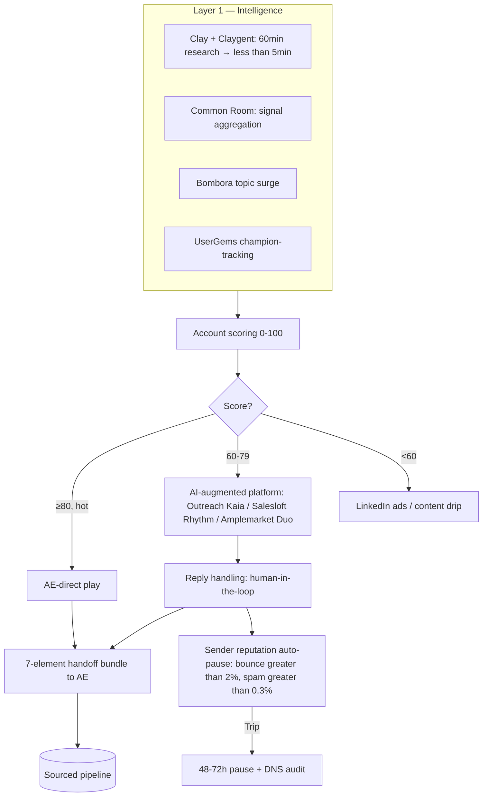

<!--
seo:
  title: Hybrid AI + Human Outbound: B2B Demand Pipeline — Domain 6
  description: What turns attention into revenue. SaaStr's 20-agent stack, Outreach Kaia vs Salesloft Rhythm vs Amplemarket Duo, Drift sunset migration to 1Mind, sender reputation auto-pause.
  primary_keyword: AI SDR hybrid outbound
  secondary_keywords: [Outreach Kaia, Salesloft Rhythm, Amplemarket Duo, Drift sunset, 1Mind, speed-to-lead, conversation handoff]
-->
## Domain 6: Demand & Conversational Pipeline

> **TL;DR.** What turns attention into revenue. **Anchor case: SaaStr (Jason Lemkin)** — 20 AI agents managed by 1.2 humans, replacing 10 SDRs+AEs. 70K hyper-personalized emails/mo (vs. 7K human), 5-7% response rates, 15% of SaaStr London revenue AI-attributed. **Tools that win:** Outreach Kaia / Salesloft Rhythm / Amplemarket Duo for AI-augmented; Default 2.0 for routing (replaces Chili Piper + LeanData + Rattle); Clay for intelligence layer. **Major 2026 change: Drift sunset Mar 6, 2026** — 1Mind named exclusive successor. **What changed in v3:** added 6 named cases (SaaStr 20-agent, Broadvoice 40% pipeline, Salesloft Rhythm benchmarks, Ideals 452 meetings, FERMÀT 5d→<3d, Apollo $150M ARR), Outreach + Salesloft 2025 product launches, sender reputation auto-pause rules (May 2025 thresholds), conversation handoff 7-element bundle, V3-V5 cross-cutting corrections (Greenhouse 50%/91% not 60%/130%, Artisan 3.9/5 not 3.5/5).

> *"With just 2.5 humans + 20 AI agents, we're now doing the same work and producing the same output as 12+ humans did before."* — Jason Lemkin, [SaaStr](https://www.saastr.com/a-great-year-with-our-20-ai-agents-but-a-rough-week/), Dec 2025

> *"No AI Agent should be giving away your product for free."* — Jason Lemkin, same SaaStr post (the Dec 2025 "rough week" post-mortem)

> *"They prefer to remain anonymous far into the buying journey, and they operate in teams of six to 10 (or even more) decision-makers."* — Latané Conant, [*No Forms. No Spam. No Cold Calls.*](https://6sense.com/no-forms-no-spam-no-cold-calls/)

**See also:** [Domain 1 (Sensing)](1-sensing-intelligence.md) for the intelligence layer feeding hybrid outbound, [Domain 4 (Distribution)](4-distribution-channel-operations.md) for inbound traffic generation, [Domain 0 (AgentOps)](0-agentops.md) for sender reputation auto-pause architecture, [Domain 8 (Measurement)](8-measurement-attribution.md) for sourced-pipeline measurement, [Domain 5 (AEO/GEO)](5-ai-search-answer-visibility.md) for inbound from AI search referrals.

### Definition and Scope

The conversion engine: What turns attention into revenue. Owns: lead capture and progressive profiling; lead scoring and routing; AI-driven outbound sequences; conversational AI for inbound qualification; meeting booking; sales handoff and context transfer; ABM orchestration; and pipeline acceleration plays.

The work changed shape. Traditional demand gen was forms-and-MQLs-and-sequences. Modern demand gen is real-time conversational engagement, intent-driven activation, and agentic orchestration. The funnel didn't die; it inverted. Buyers initiate when they're ready. Agents engage instantly. Humans take over at the qualified-meeting threshold.

### Why It Matters Now

The proof points from real deployments via Qualified's agentic marketing platform:
- **[Demandbase](https://www.qualified.com/customers/demandbase)**, 2× pipeline, 3× meetings (37% from target accounts), 100 hrs/month saved, ~$80K SDR headcount avoided, 431% more conversations, 30% lift in lead conversions (first 2 months with Piper).
- **[Greenhouse](https://www.qualified.com/customers/greenhouse)**; **50% chat-to-meeting conversion** (not 60%), **91% increase in meetings booked**, $4.2M pipeline influenced, 2× ROI in first 2 months after switching from Drift; Piper's first year: 15K conversations, 2K meetings, $27M influenced pipeline, $4M closed-won.
- **[Crunchbase](https://www.qualified.com/plus/articles/from-static-journeys-to-dynamic-decisioning-with-crunchbase)**, 67,000 chats handled by Piper, 3× meetings booked, 2× MQLs, 5-person SDR team.

But the cautionary tale is just as important. The autonomous AI SDR category exploded in 2024–2025 with massive funding (11x.ai raised $74M from a16z + Benchmark), and largely collapsed. By early 2026:
- **11x.ai customer churn:** ≥70% of customers closed/paused (summer 2024); one employee cited 70–80% loss; internal Slack data showed 20–30% retention. Claimed $14M ARR vs. ~$3M post-trial reality. Sources: [TechCrunch, Mar 24, 2025](https://techcrunch.com/2025/03/24/a16z-and-benchmark-backed-11x-has-been-claiming-customers-it-doesnt-have/) and [Sifted, Mar 26, 2025](https://sifted.eu/articles/11x-toxic-culture-ceo-working-nights-a16z).
- **Industry-wide AI SDR churn estimate of 50–70% within 12 months** is widely attributed to UserGems but lacks a published primary methodology, treat as directional, not measured. Source: [UserGems blog, Dec 2025 / Mar 2026](https://www.usergems.com/blog/are-ai-sdrs-worth-it).
- **Artisan AI** currently sits at **3.9/5 on G2 across 22 verified reviews** with a polarized distribution (72% 5★, 13% 1★), not 3.5/5. Source: [G2 Artisan page](https://www.g2.com/products/artisan-sales/reviews).
- The frequently-cited "only 2% of AI SDR implementations survive past the first year" stat **could not be traced to a primary source**, drop or replace with the verifiable Lemkin/SaaStr line ("90% of AI-SDR deployments produce zero pipeline," cited in SaaStr commentary) until methodology is published.

The lesson: fully autonomous AI SDRs work for high-volume, low-complexity outbound and consistently struggle with enterprise sales where personalization and timing matter more than volume. The most effective approach in 2026 combines an intelligence layer for deep account research with a hybrid (AI + human) execution layer.

### Sub-Domains

**6.1 Inbound Conversion**
- Website conversational AI (chat, real-time qualification)
- Form optimization (and form-less inbound paths)
- Demo-request flows
- Self-serve trial activation
- Lifecycle email programs

**6.2 Outbound Prospecting**
- Account research and prioritization
- Multi-channel sequence design (email + LinkedIn + phone + SMS)
- Hyper-personalization at scale
- AI-assisted (vs. fully autonomous) outbound
- Reply handling and meeting booking

**6.3 Lead Scoring & Routing**
- Predictive lead scoring (fit + intent)
- Routing rules (industry, geography, deal size, AE territory)
- SLA enforcement (speed-to-lead < 5 min for hot leads)
- Re-routing on no-response

**6.4 ABM Orchestration**
- Tier 1 / 2 / 3 account programs
- Buying-committee mapping (champion → economic buyer → end user)
- Multi-threaded engagement (4–7 contacts per account)
- Coordinated marketing + sales motions
- Ad targeting alignment with outbound

**6.5 Pipeline Acceleration**
- Stalled-deal nudges
- Champion enablement (helping your champion sell internally)
- Procurement / legal-stage support
- Reference customer matching
- Re-engagement of cold opportunities

**6.6 Sales Handoff & Context Transfer**
- Meeting prep automation (AE briefings)
- Conversation context handoff (chatbot → SDR → AE → CSM)
- CRM hygiene and data synchronization
- Lost-deal nurture programs

### Best Practices in 2026

**Use the intelligence layer for research, the human (or hybrid) layer for execution.** The data is clear: research/intelligence agents (Clay, custom workflows) compress 60 minutes of account research into <5 minutes per prospect. That's where the biggest leverage lives. Layer human (or AI-assisted human) execution on top, they'll outperform fully autonomous outreach.

**Match the tool to the deal complexity.** Autonomous AI SDRs (11x, Artisan, AiSDR) work for high-volume, transactional deals with simple buying processes. They fail on enterprise sales with multi-stakeholder buying committees and 12+ month cycles. For complex B2B, lean on AI-augmented platforms (Outreach Kaia, Salesloft Rhythm, Amplemarket Duo) where humans drive the relationship and AI accelerates the work.

**Lead with the inbound chat layer (Qualified, Knock AI, Intercom Fin, 1Mind) rather than outbound spam.** Inbound conversational AI converts at 60%+ when integrated cleanly. Outbound AI SDRs convert at 3-8% (vs. 5-12% for human-sent emails) and damage sender reputation when run aggressively. **Note: Drift is sunsetting March 6, 2026** (Salesloft announcement); 1Mind has been named the exclusive AI successor, and existing Drift customers are migrating en masse, see Tools section below.

**Speed-to-lead is non-negotiable.** Inbound leads contacted within 5 minutes are 21x more likely to convert than those contacted after 30 minutes. Agentic systems excel here, they can engage instantly, qualify, and book meetings without human latency.

**Multi-thread accounts deliberately.** Single-threaded outreach (one email to one persona) is dying. Multi-thread: champion + economic buyer + technical evaluator + end user, each receiving role-appropriate content. Agentic systems make this scalable.

**Audit your sender reputation weekly.** AI SDRs at scale damage domain reputation when configured poorly. Use tools like Mailreach or GlockApps to monitor inbox placement. Once damaged, recovery takes months.

**Build a "conversation handoff" protocol.** When a chatbot engages a buyer, transfers to an SDR, then to an AE, the context should travel cleanly. A buyer who has to repeat themselves three times is a buyer you've already lost. Tools like Gong + chatbot integrations + CRM context-passing matter more than fancy AI.

### Tools & Platforms

**Inbound Conversational AI**
- **Qualified**. Pipeline cloud, AI SDR for inbound (Piper). Strongest publicly-documented case studies (Demandbase, Greenhouse, Crunchbase).
- **~~Drift (Salesloft)~~. SUNSETTING March 6, 2026.** Salesloft (now operating as Clari + Salesloft) announced sunset; customers given 60–90 days to migrate. Drift had also gone offline in Sept 2025 after an OAuth breach affecting 700+ orgs (Cloudflare, Palo Alto, Zscaler). Do not start new Drift implementations.
- **1Mind**. Named exclusive AI successor to Drift by Salesloft (March 2026). The default migration target for ex-Drift customers.
- **Knock AI**. Messaging-first inbound (Slack, LinkedIn, WhatsApp).
- **Intercom Fin**. Customer support + conversational marketing crossover.

**Outbound AI SDR Platforms (proceed with caution)**
- **Artisan AI**; "Ava" autonomous SDR, ~$2,200+/mo. Multi-agent system.
- **11x.ai**; "Alice" + "Jordan" autonomous SDR + phone agent. $5,000+/mo. Note: significant customer churn issues.
- **AiSDR**, autonomous outbound
- **Salesforge**, voice-AI heavy
- **Regie.ai**, agentic outbound, deep Outreach/Salesloft integration. Starts $35,000/yr.

**AI-Augmented Sales Engagement (the more sustainable path)**
- **Outreach**. Kaia AI assistant + Smart Account Assist + Research Agent (Aug/Nov 2025 releases). Source: [Outreach Aug 2025 release](https://www.outreach.io/resources/blog/august-2025-product-release).
- **Salesloft**. Rhythm AI prioritization + AI Email Assistant + Signal-Enhanced Research Briefs (Dec 2025 release). Source: [Salesloft Dec 2025 release notes](https://champions.salesloft.com/product-updates/december-2025-release-notes-507).
- **Amplemarket**. Duo Copilot, three-agent system, ~$3,200/user/yr at 25 users.
- **Apollo.io**. All-in-one prospecting + engagement, accessible price point.

**Account Research & Enrichment**
- **Clay**. Programmable enrichment + AI research agent. From $134/mo. The "GTM engineer's choice." Steep learning curve, exceptional output.
- **Cognism**. EU-strong contact data + intent
- **LeadIQ**. Mid-market SDR-focused
- **ZoomInfo Engage**. Big database, integrated workflow

**Pipeline Orchestration**
- **Default**. Lead routing, signal-to-action automation
- **Chili Piper**. Inbound routing and scheduling
- **Distribute**. Lead routing alternative
- **Calendly / Cal.com**. Meeting booking layers

**Salesforce Native**
- **Salesforce Agentforce**. Salesforce's agent platform; deep CRM integration
- **HubSpot Breeze**. HubSpot's agent layer

### Notable Practitioners & Frameworks

- **Kraig Kleeman / Sara Storm** (predictive lead scoring evangelists)
- **Sangram Vajre**. ABM frameworks
- **Trish Bertuzzi**; *The Sales Development Playbook*
- **Jeb Blount**; *Fanatical Prospecting*
- **Becc Holland**, personalization at scale
- **Kyle Coleman (formerly Clari, now Copy.ai)**, modern revenue operations
- **Kevin "KD" Dorsey**, sales development leadership
- **Matt Heinz**, full-funnel B2B
- **Jason Lemkin (SaaStr)**; [Lenny's Newsletter (Apr 2025) "We Replaced Our Sales Team with 20 AI Agents"](https://www.lennysnewsletter.com/p/we-replaced-our-sales-team-with-20-ai-agents). Lemkin + CAIO Amelia Lerutte run **20 AI agents managed by 1.2 humans, replacing 10 SDRs+AEs** after two reps quit pre-Annual 2024. Volume: **70K hyper-personalized emails/mo** (vs. 7K human), **5–7% response rates**, **15K+ messages**, **150K+ community chats**, **15% of SaaStr London revenue** AI-attributed. *Caveat:* a "rough week" [post-mortem](https://www.saastr.com/a-great-year-with-our-20-ai-agents-but-a-rough-week/) showed agents drifting on a payments edge case.

### Named Case Studies (beyond Qualified)

| Case | Architecture | Result | Source |
|---|---|---|---|
| **Broadvoice (AI-augmented outbound, Amplemarket Duo)** | AI-recommended leads + multi-region deliverability | **40% of total pipeline**, **5× reply rate** on AI-rec leads (only <3% rejected by team), <1.5% bounce, one international deal closed in **2 weeks vs. 4–6 month** typical | [Amplemarket](https://www.amplemarket.com/customers/broadvoice) |
| **Thrive Learning UK (Amplemarket)** | Reduced SDR team **7→1**: AI-rec leads delivered 7× interest | **+242% interested responses, +200% opens/replies, 2 hours/day saved per rep**, 10.7× signal-driven interest | [Amplemarket](https://www.amplemarket.com/customers/thrive) |
| **FERMÀT (Default lead-routing)** | Replaced Chili Piper + LeanData + Rattle into Default; consolidated 30+ workflows | **Lead-to-meeting 5 days → <3 days** (40% faster), **+15% show rate, +25% win rate** on meetings booked within 2 days, setup time 1-2 days/asset → **5 minutes**: 30× more demo booking surface area | [Default case](https://www.default.com/case-study/how-fermat-scaled-revops-without-rebuilding-their-gtm-stack) |
| **Ideals (Amplemarket Duo)** | AI sequencing + signals | **452 meetings in 3 months, 53% open rate** | [Amplemarket](https://www.amplemarket.com/customers) |
| **DataStax (Amplemarket Duo)** | Enterprise outbound | **150+ enterprise opportunities in 8 months** | [Amplemarket](https://www.amplemarket.com/customers) |
| **Salesloft Rhythm (platform-wide benchmarks)** | AI prioritization + Account Agent (Dec 2025) | **AEs +39% tasks/day, SDRs +57% productivity, +25% close rate, 2× ACV, 20% shorter deal length** | [Salesloft](https://www.salesloft.com/company/newsroom/results-are-in-ai-powered-salesloft-rhythm-drives-meaningful-productivity-and-revenue-outcomes-for-global-sales-organizations) |
| **Chili Piper 4M form benchmark** | Form-conversion analysis across 4M submissions | **391% conversion lift when responding within 1 minute**; conversion drops sharply past 5 minutes | [Chili Piper](https://www.chilipiper.com/post/form-conversion-rate-benchmark-report) |

### Tools & Platforms, head-to-head deep-dive

#### AI-augmented sales engagement (the sustainable path)

| Dimension | Outreach + Kaia | Salesloft + Rhythm | Amplemarket Duo |
|---|---|---|---|
| **Pricing** | $100–160/user/mo (Amplify Core/Plus/Pro), tier-quoted; +$5–25K implementation; +$2–5K annual platform fee | ~$125–165/user/mo list, ~$100–130 negotiated; Rhythm + Conversations + Deals are paid add-ons (+15–30% of base) | $600/mo Startup floor (annual only); Growth/Elite tiers $2K–5K/mo for mid-market; +$300–400/extra user |
| **AI flagship (2025-26)** | Research Agent + Deal Agent (Aug 2025); Personalization Agent across email/LinkedIn/calls; Kaia for real-time call coaching | Rhythm + Account Agent (Dec 2025 Signal-Enhanced Briefs); AI Email Assistant; Dynamic Cadences with AI-generated steps | Three-agent system: Duo Copilot + Duo Copywriter + Duo Voice; signal-driven lead recs |
| **Best fit** | Enterprise sales orgs already on SFDC; large rep teams 100+; high data-governance needs | Mid-enterprise; teams consolidating Drift; signal-to-action in one workflow | Lean teams (1–25 reps); single integrated platform vs. stitching Apollo + Outreach + Cognism + Lusha |
| **Documented impact** | Closes 11 days off cycles, +10pp win rate on $50K+ deals | +39% AE tasks/day, +57% SDR productivity, +25% close rate, 2× ACV | Broadvoice 40% pipeline / Thrive 7→1 SDR / Ideals 452 meetings |
| **Switching cost** | Highest — implementation 60–90 days; multi-year discounts | High — 2–3yr contracts; Drift sunset is forcing migrations | Lower — annual contract; reduces stack |

#### Apollo vs. Clay (mid-market vs. GTM engineering)

| | Apollo | Clay |
|---|---|---|
| **Pricing** | $0/$49/$79/$119 per user/mo (Free/Basic/Pro/Org annual) | $134–$720+/mo plans; $185/mo Launch tier (March 2026 restructure); credits = Columns × Rows |
| **Scale 2025** | $150M ARR (May 2025, up from $134M end-2024); 500% YoY AI platform usage growth; 50K+ weekly active users | $100M ARR crossed (1→100 in 2 yrs post-foundation); $100M Series B Aug 2025; $1B+ valuation |
| **Buying** | Prospecting database + sequencing + dialer in one login/bill | Programmable enrichment + Claygent (AI research agent); connects to everything |
| **Operator** | Lean SDR/AE without GTM engineer | RevOps + GTM engineering function with workflow muscle |
| **Performance benchmark** | 2.37% email-to-meeting (independent), 45% lower bounce w/ waterfall | 2-3× mobile phone coverage in EU vs. solo providers; Anthropic + OpenAI both run Clay as primary infra |

#### Pipeline orchestration

| | Chili Piper | Default | Distribute |
|---|---|---|---|
| **Origin** | Original speed-to-lead leader (Distro + Concierge) | Newer; "first AI-powered routing agent" — natural language rules | Lead-routing alternative; narrower scope |
| **Strength** | Mature web-form + booking flow; 4M-form benchmark library; 391% lift at 1-min response | Replaces Chili Piper + LeanData + Rattle in one orchestration layer | Fair-distribution focus, simpler than LeanData |
| **Customer signal** | Inbound-heavy mid-enterprise wanting the original | Modern AI-native: Hex, OpenPhone, Bland, StackBlitz, Cortex, FERMÀT | Teams w/ simple round-robin needs |

#### Sender reputation tools (the May 2025 Google/Yahoo/MSFT thresholds)

| | Mailreach | GlockApps |
|---|---|---|
| **Core product** | Warmup + spam testing on 30+ inboxes | Inbox placement testing + DMARC analytics + blocklist monitoring |
| **Pricing** | $9.6/mo spam testing; $25/mo warmup | From $59/mo; doesn't sell warmup as a service |
| **Best for** | Cold outbound teams that need warmup discipline + provider-realistic test | Newsletter senders + complex deliverability troubleshooting (DMARC, SpamAssassin) |
| **Auto-pause threshold** | bounce >2%, spam >0.3%, placement <80–85% (the enforced May 2025 thresholds) | Same thresholds; deeper DMARC analytics |

### Tactical Playbooks

#### Hybrid AI + human outbound, architecture diagram

Layer 1 compresses research from 60 min → <5 min. Layer 2 sends the messages. Layer 3 keeps human-in-the-loop for replies. The 7-element handoff bundle (transcript + AI summary + intent + sentiment + customer ID + confidence + escalation trigger) drives 15-25% SQL→opportunity conversion lift.

#### Playbook A. Hybrid AI + Human Outbound Architecture

**Layer 1. Intelligence:** Clay (or Common Room, Amplemarket signals) compresses 60-min account research → <5 min. Triggers: PQL signals, GitHub/community engagement, job switchers, competitive job postings (Semgrep's 16 plays = the reference set).
**Layer 2. Execution:** Human SDR or AI-augmented platform (Outreach Kaia, Salesloft Rhythm, Amplemarket Duo) sends multi-channel sequences with AI-generated personalization based on Layer 1's findings.
**Layer 3. Reply handling:** Human-in-the-loop for replies + objection handling. Reserve fully autonomous AI for clearly out-of-office or easy reschedules.
**Why it works:** The lift comes from the intelligence layer, not the execution layer (Broadvoice's 5× reply rate from AI-rec leads vs. Lemkin's 5–7% requiring heavy training over tooling).
**Cross-link:** Mahmoud's [`cold-email`](skill) skill, copy/cadence layer slots in here.

#### Playbook B. Sender Reputation Auto-Pause Rules

**Monitor weekly:** Mailreach OR GlockApps based on bottleneck (warmup volume vs. DMARC complexity).
**Auto-pause triggers (the May 2025 Google/Yahoo/MSFT enforced thresholds):**
- Bounce rate > 2% on any single send → pause campaign immediately
- Spam complaints > 0.3% (target ≤0.1% for Gmail) → pause sender
- Inbox placement dropping below 80–85% → pause new sends, audit
- Hard-stop pause: 48–72h while diagnosing SPF/DKIM/DMARC/reverse DNS/HELO consistency

**Warmup discipline:** Start 20–40 emails/inbox/day, ramp over 2–4 weeks. Daily volume cap = ICP saturation × open-rate × 4 (heuristic; throttle if hitting any single inbox cluster too aggressively).

#### Playbook C. Speed-to-Lead Routing Under 5 Minutes

**Stack:** Form (any) → Default (or Chili Piper) routing agent → AI qualifier (Qualified, 1Mind, Knock AI) → calendar (Cal.com / Calendly / Chili Piper booker) → Slack alert (built-in or Default-native, replacing Rattle).
**Configuration:**
- Route by AE territory + deal-size band + intent score in <30 seconds
- AI qualifier engages instantly (the 1-minute window = 391% conversion lift per Chili Piper's 4M form data)
- If AE not online within 5 min, fall through to AI book-a-meeting + same-day re-engagement
- Surface "hot lead" in Slack with consolidated context (account + signals + persona)
**Reference outcomes:** FERMÀT cut lead-to-meeting from 5 days → <3 days; +15% show rate; +25% win rate when meeting booked within 2 days. Cortex consolidated Chili Piper + LeanData + Rattle into Default and reduced manual fix work 50–90%.

#### Playbook D. Conversation Handoff Protocol (chatbot → SDR → AE → CSM)

**The 7-element bundle to pass at every handoff:**
1. Full conversation transcript
2. AI-generated 3-bullet summary
3. Detected intent + specific issue classification
4. Sentiment + frustration level (numeric)
5. Customer ID + firmographic/technographic snapshot
6. Confidence score on intent (escalate when low)
7. Escalation trigger (what tipped the bot to hand off)

**On the SDR→AE side, add:** scored account, identified buying committee members with titles + roles, original trigger signal, SDR call notes, engagement history.

**Documented impact:** +15–25% SQL→opportunity conversion when this bundle is present vs. cold AE inheritance. With Drift sunsetting March 6, 2026 → 1Mind, this protocol must be explicitly designed during migration, not inherited from Drift's old context model.

### Cross-References to Mahmoud's Skills

| Where it links | Mahmoud's skill | How to integrate |
|---|---|---|
| Cold outbound copy + sequence design | `cold-email` | Domain 6 references the architecture (intelligence + execution layers); `cold-email` owns copy/cadence/follow-up. Don't duplicate. |
| Demo-request, lead-capture, contact forms | `form-cro` | Domain 6 covers routing + speed-to-lead post-form; `form-cro` owns field-count, friction, qualification logic before submission. The FERMÀT "Universal Content Form + Book-a-Demo" pattern lives in `form-cro`. |
| PLG / trial signup flows | `signup-flow-cro` | When inbound is from product signup rather than demo form, the flow design feeding the AI chat qualifier sits in `signup-flow-cro`. |
| Lead scoring, MQL→SQL handoff, CRM hygiene | `revops` | The whole 6.3 (Lead Scoring & Routing) and 6.6 (Sales Handoff) sub-domains lean on `revops` for systems plumbing. Conversation handoff protocol is co-owned. |

### Industry overlay (Q2 2026)

| Industry | ICP / motion difference | Tools that win | Biggest pitfall | Compliance overlay |
|---|---|---|---|---|
| **B2B SaaS** | Inbound demo + outbound multi-channel; speed-to-lead <5 min; multi-thread 4-7 contacts/account; avg cycle 60-180 days | Qualified or 1Mind (Drift sunset Mar 2026) for chat; Outreach Kaia / Salesloft Rhythm / Amplemarket Duo; Default for routing; Clay for research | Buying autonomous AI SDR (Artisan, 11x.ai) before ICP is validated — 11x lost 70-80% of customers in 12 mo | CASL/GDPR consent; sender reputation (May 2025 Google/Yahoo/MSFT thresholds) |
| **Biopharma** | "Pipeline" = MSL meeting, KOL advisory board seat, formulary review request, CRO/biopharma RFP. Cycle: 12-24 months. AE = clinical liaison + sales rep dyad. **No cold email to HCPs in EU; restricted in US** | **Veeva CRM + Engage**: Aktana for next-best-action; PathFactory for HCP content; Pulsar/IQVIA OneKey for HCP routing; Komodo for patient-flow targeting | Using B2B AI SDR cadences on physicians — instant brand damage with KOLs and likely Sunshine Act + GDPR violations. AI cold-call to HCP is illegal in some EU countries | Sunshine Act on every HCP interaction including digital; HIPAA on patient data in CRM; GDPR for EU HCPs; off-label conversation logging (MSLs use compliant tools like Mediafly/Veeva CLM) |
| **DTC** | "Pipeline" = cart adds, checkout completion, repeat purchase, LTV. Speed-to-lead is irrelevant; checkout friction is everything. SMS/email lifecycle replaces SDR | Klaviyo + Postscript + Attentive for lifecycle; Recharge for subscriptions; Gorgias for support→sales; Shopify + Shop Pay one-click | Treating inbound chat as sales (Qualified-style) when shoppers want fast support — wrong tool, wrong KPI | TCPA on SMS opt-in (express written consent + STOP/HELP); CCPA disclosure |
| **Dev tools** | "Pipeline" = signup → activation (first API call, first deploy) → expansion → enterprise upgrade. PQL replaces MQL. Reps engage at $X spend threshold or specific feature use | Amplitude/Mixpanel for PQL; Pocus or Endgame for PLG signal-to-rep; HockeyStack for attribution; community-led (Discord/Slack) signals via Common Room | Inserting BDR-driven outbound on free users — they churn the tool and the brand. PLG demands signal-gated outreach only | Same as SaaS; OSS licenses if monetizing community contributions |

**Key insight:** Biopharma demand is **explicitly advisory** in many jurisdictions, no autonomous AI agent can close a physician on a prescription. The agent layer compresses MSL prep + KOL research + congress follow-up; humans (with credentials) own every external interaction. BenchSci's "VP of Marketing AI-Native & Autonomous Operations" job spec hints at this exact internal-leverage pattern.

### Common Failure Modes

- **Buying autonomous AI SDR before validating the ICP.** The most expensive mistake in outbound. AI amplifies bad inputs: garbage ICP → garbage at scale.
- **Damaged sender reputation from over-aggressive AI outreach.** Once your domain is flagged, recovery takes 60–90 days minimum. Daily volume + warmup discipline are non-negotiable.
- **Ignoring deliverability infrastructure.** Most AI SDR platforms don't include sending domains or inboxes. Budget $15–50/mo for dedicated sending domains and warmup.
- **No human review layer for outbound at scale.** Even teams using "autonomous" AI SDRs typically need 2–5 hours/week of human oversight to maintain quality.
- **Slow speed-to-lead.** A hot lead waiting 30+ minutes is a cold lead.
- **MQLs over pipeline.** Optimizing for lead volume produces MQL hamster wheels. Optimize for sourced opportunity, not MQL count.

### KPIs

- **Sourced pipeline** (the only metric that matters)
- **Meetings booked → opportunity created → closed-won conversion rates**
- **Cost per opportunity** (by source)
- **Pipeline coverage ratio** (typically 3-4x of ARR target for B2B)
- **Reply rate** by sequence/persona (benchmark: 5-12% for human-sent, 3-8% for AI-only)
- **Speed-to-lead** (minutes from inbound to first response)
- **Sender reputation score** (Mailreach / GlockApps)
- **Multi-threading rate** (% of pipeline accounts with 4+ engaged contacts)

### Resources for Deeper Study

**YouTube channels**
- **Outbound Squad** (Jason Bay), modern outbound
- **Sales Hacker**, broad B2B sales education
- **30 Minutes to President's Club**, practical sales tactics
- **Salesloft / Outreach** (channels), product education + best practices
- **Apollo Academy**, outbound fundamentals
- **Clay's YouTube**. GTM engineering
- **Common Room**, community + signal-driven pipeline
- **SaaStr Annual** (Jason Lemkin), frequent AI SDR experiments

**Podcasts**
- *30 Minutes to President's Club*
- *Sales Logic* (Mark Hunter, Meridith Elliott Powell)
- *The Sales Engagement Podcast* (Outreach)
- *Sales Hacker Podcast*
- *Make It Happen Mondays* (John Barrows)

**Books**
- *Fanatical Prospecting* (Jeb Blount)
- *The Sales Development Playbook* (Trish Bertuzzi)
- *Predictable Revenue* (Aaron Ross), foundational, despite some outdated tactics
- *Combo Prospecting* (Tony J. Hughes)
- *Gap Selling* (Keenan)

**Newsletters / Substacks**
- Outbound Squad newsletter
- Common Room blog
- Refine Labs / Passetto content

---

## v3 (shipped Apr 2026)

- [x] V3 corrections. Greenhouse 50%/91% (was 60%/130%); Artisan 3.9/5 (was 3.5/5)
- [x] V4 sourcing, 11x.ai churn TechCrunch + Sifted; '2% survive' flagged unverifiable
- [x] V5 vendor M&A. Drift sunset Mar 6, 2026 + 1Mind successor; Outreach Aug 2025 + Salesloft Dec 2025 product launches integrated
- [x] Lemkin verbatim quotes (incl. 'No AI Agent should be giving away your product for free')
- [x] 6 named cases (SaaStr 20-agent stack, Broadvoice 40% pipeline, Salesloft Rhythm benchmarks, Ideals 452 meetings, FERMÀT 5d→<3d, Apollo $150M ARR scale)
- [x] Hybrid AI+human outbound Mermaid diagram
- [x] 4 tactical playbooks (hybrid outbound, sender reputation auto-pause with May 2025 thresholds, speed-to-lead routing, 7-element conversation handoff bundle)
- [x] Tooling comparisons (Outreach Kaia vs. Salesloft Rhythm vs. Amplemarket Duo; Apollo vs. Clay; Chili Piper vs. Default vs. Distribute; Mailreach vs. GlockApps)
- [x] Industry overlay + cross-references (5 inter-domain + 4 skills)

## v4 deferred

- [ ] Second-wave AI SDR cases (post-2025 collapse), what actually works as the category recovers
- [ ] Conversation-handoff impact at named enterprise B2B with documented SQL→opp lift numbers

See [research-plan.md](research-plan.md) for the master v3 changelog and v4 forward plan.
---

## Frequently Asked Questions — Domain 6: Demand & Conversational Pipeline

### Why did autonomous AI SDRs collapse?

11x.ai lost ≥70% of customers (TechCrunch + Sifted, March 2025); Artisan AI sits at 3.9/5 on G2 with polarized reviews. Industry-wide AI SDR churn is reportedly 50-70% within 12 months (UserGems data, treat as directional). The lesson: fully autonomous AI SDRs work for high-volume, low-complexity outbound but fail on enterprise sales with multi-stakeholder buying committees and 12+ month cycles. Buying autonomous AI SDR before validating ICP amplifies bad inputs at scale.

### What's the right AI-augmented sales stack in 2026?

Three platforms compete: Outreach + Kaia (deepest enterprise integration, Research Agent + Deal Agent, ~$100-160/user/mo + implementation), Salesloft + Rhythm (Account Agent with Signal-Enhanced Briefs, +57% SDR productivity per platform-wide data, ~$125-165/user/mo), Amplemarket Duo (three-agent system for lean teams, $600/mo Startup floor). Decision rule: enterprise sales orgs already on Salesforce → Outreach; mid-enterprise migrating from Drift → Salesloft; lean teams 1-25 reps → Amplemarket Duo.

### What happened to Drift?

Salesloft (now operating as Clari + Salesloft) announced Drift sunset on March 6, 2026. Customers got 60-90 days to migrate. Drift had also gone offline in September 2025 after an OAuth breach affecting 700+ orgs (Cloudflare, Palo Alto, Zscaler). 1Mind has been named the exclusive AI successor by Salesloft. Do not start new Drift implementations. Existing Drift customers are migrating to 1Mind, Qualified, Knock AI, or Intercom Fin.

### What is the 7-element conversation handoff bundle?

When a chatbot transfers to an SDR (or SDR to AE), seven items must travel: full conversation transcript, AI-generated 3-bullet summary, detected intent + specific issue, sentiment + frustration level (numeric), customer ID + firmographic snapshot, confidence score on intent, and the escalation trigger. Documented impact: 15-25% SQL→opportunity conversion lift when the bundle is present vs. cold AE inheritance. Critical now because Drift's sunset to 1Mind means every B2B SaaS team is rebuilding handoff logic in 2026.

