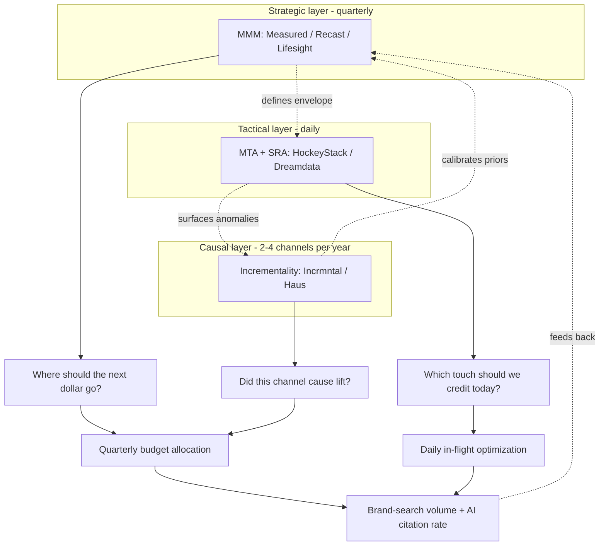

<!--
seo:
  title: Triangulated Marketing Measurement, MMM + Incrementality + MTA (Domain 8)
  description: Without measurement, the rest is theater. Refine Labs $50M HIRO from SRA, PODS Recast +181%, Soft Surroundings 52% retargeting cut to +17% revenue, open-source MMM (Robyn / Meridian).
  primary_keyword: marketing measurement triangulation
  secondary_keywords: [marketing mix modeling, incrementality testing, self-reported attribution, Meta Robyn, Google Meridian, AIMx framework]
-->
## Domain 8: Measurement, Attribution & Closed-Loop Learning

The mirror. Without this domain, the rest is theater. The work is multi-touch attribution, channel ROI and customer acquisition cost, content performance, pipeline health, conversion benchmarks, brand metrics, and the experimentation infrastructure (A/B tests, holdouts, geo-tests, incrementality testing) that lets you tell what's working from what isn't. The closed-loop part is the most important: insights here feed back into Domains 1 through 7, so the rest of the OS gets smarter over time.

> *"If you have $100 to invest in smart decisions, invest $10 in brilliant human analytical strategists, invest $90 in AI activation."* (Avinash Kaushik, now CSO at Human Made Machine, [*Bye, Bye Human-Powered Marketing Analytics*](https://www.kaushik.net/avinash/bye-human-powered-marketing-analytics-hello-ai-powered-analytics/), 2024, the AI-era update to his original 10/90 rule)

> *"The most accurate way to get attribution is simply by asking them!"* (Chris Walker, CEO, Passetto, [LinkedIn](https://www.linkedin.com/posts/chriswalker171_attribution-revenue-b2b-activity-7021126918821347328-R5CQ), Jan 2023)

**See also:** Mahmoud's [`ab-test-setup`](skill) for experimentation tactics, [`mahmouds-seo-guide-v3` `analytics-measurement.md`](skill) for AI-search-specific measurement, [Domain 1 (Sensing)](1-sensing-intelligence.md) for signal-to-meeting conversion as the upstream metric, [Domain 4 (Distribution)](4-distribution-channel-operations.md) for self-reported attribution methodology, [Domain 6 (Demand)](6-demand-conversational-pipeline.md) for sourced-pipeline measurement, [Domain 7 (Customer Intel)](7-customer-intelligence-synthetic-testing.md) for synthetic-to-live correlation as a continuous KPI, [Domain 0 (AgentOps)](0-agentops.md) for AgentOps cost attribution, [Domain 5 (AEO/GEO)](5-ai-search-answer-visibility.md) for AI-search KPIs (citation rate, share of voice, AI referral conversion).

### Why this matters now

Marketing measurement is in a quiet crisis. The IAB's 2026 State of Data Report surveyed more than 400 senior planning and analytics decision-makers, and 75% of them said their current measurement approaches fall short on speed, accuracy, or trust. Only 41% of marketers can confidently prove AI ROI, down from 49% the year before (Jasper, 2026). The IAB's Project Eidos puts industry waste from inconsistent measurement definitions at roughly $9B per year. Meanwhile B2B buyers spend only 17% of their buying time talking to vendors; the other 83% happens in places conventional analytics can't see.

Three structural shifts caused this and shape what works in 2026.

**The death of user-level attribution.** Apple's App Tracking Transparency, third-party cookie deprecation, and tightening privacy regulations have gutted the click-based attribution model that dominated 2010 to 2020. Multi-touch attribution (MTA), the model that says "this lead clicked these five ads in this order, here's how to credit them," is getting less accurate every quarter. The data it depended on is just gone.

**The rise of triangulated measurement.** No single method tells the full story now. The teams that have a working measurement function combine three approaches: marketing mix modeling (MMM) as the strategic backbone, incrementality testing for causal validation, and attribution for in-flight tactical signals. The 2026 academic articulation of this is the AIMx framework paper, but the idea is older: integration is the unlock, not picking the right single method.

**AI inside the measurement layer itself.** Half of US brand and agency marketers have adopted AI/ML for automated reporting. 60.9% list "AI that can summarize what the data means in English" as their top requested feature in next-gen MMM (eMarketer/Skewb, Oct 2025). Avinash Kaushik's classic 10/90 rule (10% on tools, 90% on smart people) has been updated for the AI era to "$10 in brilliant analytical strategists, $90 in AI activation." The smart-person budget shrinks; the AI execution budget grows.

### What measurement actually involves

Eight clusters of work sit inside this domain. Most teams are doing two or three of them well and the rest poorly.

**Marketing mix modeling (MMM)** is the strategic backbone. It uses spend, exposure, and outcome data across all your channels to figure out the incremental contribution of each one, the saturation curve, and the diminishing returns. Privacy-native because it doesn't depend on user-level tracking. The output is "we should move $200K from retargeting to YouTube ads."

**Incrementality testing** is the causal layer. The gold standard is a randomized holdout (you withhold a channel from a representative slice of the audience and see if outcomes drop). Geo-based experiments (treat one set of cities, control another) work for offline channels. Platform-native lift tests (Google, Meta) are easier to run but less rigorous. The output is "this channel actually caused this much of the lift, not just correlated with it."

**Multi-touch attribution (MTA), the version that still works.** Pure cookie-based MTA is dying, but the discipline survives in narrower forms: first-party identity resolution, server-side tracking (cookie-independent), CRM-based touch tracking, and self-reported attribution (the "how did you hear about us?" field on your demo form). Useful for in-flight tactical optimization, not for proving channel ROI.

**Pipeline and revenue analytics** is the unsexy operating layer: pipeline coverage and velocity, stage-to-stage conversion rates, win/loss analysis, cohort retention and expansion, customer lifetime value. The numbers your CFO actually cares about.

**Brand metrics** is share of voice (organic, paid, AI), brand search volume, direct traffic, sentiment analysis, and dedicated brand-tracking studies. Slow-moving but durable, and increasingly important as AI search reshuffles direct discovery.

**Content and channel performance** is content-influenced pipeline (not just page views), channel ROI and customer acquisition cost by segment, content half-life and refresh cycles, and engagement quality (dwell time, scroll depth, return visits). The level of detail that lets you say "this format works for this segment, this one doesn't."

**Experimentation infrastructure** is the system for running A/B and multivariate tests, geo-tests for offline channels, holdouts, statistical power analysis. The plumbing that lets you actually answer your own questions instead of arguing about them in slack.

**Reporting and decision velocity** is the speed layer: real-time dashboards, AI-generated insight summaries, anomaly detection, decision-support agents that recommend budget shifts and flag underperforming creative. The piece that turns measurement into action instead of leaving it as a deck nobody reads.

### What works in 2026

**Triangulate. Don't pick one method.** The brands that have measurement under control use MMM as the strategic backbone, validate the largest channels with incrementality tests, and use attribution for in-flight directional signal. Each method answers a different question. MTA tells you what touched the customer. Incrementality tells you what caused the lift. MMM tells you what the channel mix should be.

**Demand causal validation in your MMM.** Modern MMM platforms include incrementality testing as a core feature. If a vendor pitches MMM without mentioning causal validation, they're behind the times.

**Move from weekly to daily updates.** 2025 MMM was weekly and retrospective. 2026 MMM is real-time, predictive, and feeding insights directly into the agents running your campaigns. If your MMM still updates monthly, you're flying blind on a quarterly basis.

**Capture self-reported attribution at every conversion point.** A free-text "how did you hear about us?" field on demo forms is the cheapest, highest-leverage attribution upgrade you can make. Pair it with sales discovery questions and reconcile against your software attribution. The Refine Labs case from Domain 4 shows how big the gap can be: a 93% blind spot on LinkedIn pipeline.

**Run incrementality tests on your top three channels.** Without causal validation, you're optimizing based on correlation, which is how you end up over-investing in retargeting that wasn't actually driving incremental revenue. Soft Surroundings cut retargeting 52% after incrementality tests revealed they were over-served, reallocated to Facebook prospecting, and saw revenue go up 17% month-over-month.

**Embed measurement into your agent workflows.** Modern measurement platforms expose APIs that feed insights directly into AI marketing agents. The agent shouldn't be optimizing against platform-reported ROAS; it should be optimizing against validated, incrementality-grounded performance.

**Account for the dark social problem.** When 83% of buying time happens in places you can't track, traditional analytics is structurally incomplete. Layer in sales discovery questions, open-text form fields, brand-tracking surveys, passive awareness tools like SparkToro and Wynter, and direct/branded-search traffic as proxy signals. None of these are perfect; together they're better than the dashboard alone.

### Tools & Platforms

**Marketing Mix Modeling**
- **Measured**. Modern triangulated MMM with incrementality. AI-powered, daily updates. ~$250K-$500K/yr for mid-market.
- **Recast**. Bayesian MMM, transparent methodology
- **Lifesight**. Causal MMM with agentic interpretation layer (MIA)
- **Analytic Partners**. Enterprise MMM
- **Nielsen**. Legacy MMM, still relevant for traditional media
- **OptiMine**. Mid-market MMM

**Open-Source MMM**
- **Meta Robyn**. Free, requires technical expertise
- **Google Meridian**. Free, Google's open-source MMM
- **PyMC-Marketing**. Bayesian MMM library

**Incrementality Testing**
- **Incrmntal**. Always-on causal AI incrementality, privacy-first
- **Haus**. Geo-experiments, measurement consultancy
- **Northbeam**. Attribution + incrementality for DTC
- **Triple Whale**. DTC-focused attribution + incrementality
- **Platform-native:** Meta Lift Studies, Google Ads Lift, LinkedIn Lift Test

**Multi-Touch Attribution & Pipeline**
- **HockeyStack**. Unified GTM analytics + AI Revenue Agents (conversational insights). Best for mid-market B2B wanting fast time-to-value (weeks).
- **Dreamdata**. B2B activation + multi-touch attribution + AI signals; CRM-tied account journey. Best for clean account-level journeys + content ROI; PLG-ish workflows. Several-month implementation.
- **Adobe Marketo Measure** (formerly Bizible). Enterprise B2B; rebranded from Bizible in March 2022 after Marketo's 2018 acquisition. Best for orgs already on Marketo Engage + Salesforce.
- **Plannuh** (acquired by HubSpot), marketing budget + planning

**Self-Reported Attribution**
- **HubSpot / Salesforce custom fields**, most teams build this themselves
- **Refer / FunnelEnvy**, purpose-built tools

**Experimentation Infrastructure**
- **Optimizely / VWO / Convert**. A/B testing
- **Statsig / Eppo / GrowthBook**, feature flags + experimentation
- **Geo-experimentation:** Haus, Northbeam (built-in)

**Reporting & Insight Generation**
- **Looker Studio (Google)**, free, flexible
- **Tableau / Power BI**, enterprise BI
- **Improvado**, marketing data warehousing
- **Funnel.io**, marketing data integration
- **Supermetrics**. ETL for marketing data

**B2B-Specific Closed-Loop**
- **Common Room**, community → pipeline attribution
- **Default**, signal → pipeline attribution
- **Champify**, champion-tracking attribution

### Named Case Studies

| Brand | What they did | Result | Source |
|---|---|---|---|
| **PODS** (logistics, B2B-relevant) | Switched from legacy 2x/year MMM to Recast (weekly updates) | After go-dark test confirmed underinvestment: **+181% Google Non-Brand Search spend**; let other MMM/MTA contracts expire | [Recast case](https://getrecast.com/pods-case-study/) |
| **Soft Surroundings** (DTC, retargeting) | Cut retargeting **52%** after Measured incrementality test revealed over-served frequency caps; reallocated to Facebook prospecting | **+17% revenue MoM, +12% YoY** | [Measured](https://www.measured.com/blog/what-is-incrementality-guide-to-understanding-and-measuring-incrementality/) |
| **Refine Labs** (own consultancy, self-reported attribution since Jul 2021) | Implemented hybrid attribution: software attribution + open-text "How did you hear about us?" | **24-month outcome: $50M HIRO pipeline, $14M closed-won ARR.** Software attribution alone would have credited LinkedIn with $977k closed-won, a **93% gap** | [Refine Labs hybrid attribution](https://www.refinelabs.com/article/hybrid-attribution-framework) |
| **Lifesight Omni-Channel Retailer** ($4.5M monthly spend) | Custom causal MMM integrating online + in-store + display + social | **+32% incremental revenue, lower iCPA, higher in-store conversion** by shifting from discount-driven to full-price acquisition | [Lifesight case](https://lifesight.io/case-study/incremental-revenue-omni-channel-retailer/) |
| **Lifesight $1B Gaming App** (post-iOS14 ATT) | Custom MMM identified saturation in bottom-funnel; reallocated to top-funnel brand | **+8% incremental revenue, +10% in-game purchases, -6% CAC at flat budget** | [Lifesight case](https://lifesight.io/resources/case-study-gaming-mobile-app-grows-8-percent-incremental-revenue/) |
| **Jones Road Beauty** (NYC OOH) | Haus Fixed Geo Test against synthetic control DMAs | **+9% lift in New Orders, 0% lift in Repeat Orders**, which proved OOH's role for acquisition but not retention; informed channel role rather than budget cut | [Haus case](https://www.haus.io/case-study/jones-road-beauty-uses-a-fixed-geo-test-to-measure-their-big-apple-ooh-campaign) |
| **Semgrep** (B2B, attribution by community signal proxy) | Common Room: shifted outbound from cold-ICP-match to warm-signal-match | **+74% pipeline in a single quarter** | [Common Room](https://www.commonroom.io/customers/semgrep-warm-outbound-grow-pipeline/) |

### Tools & Platforms (Q1 2026 deep-dive)

#### MMM platforms, head-to-head

| Platform | Methodology | Cadence | Pricing | Best for |
|---|---|---|---|---|
| **[Measured](https://www.measured.com/)** | Causal MMM auto-calibrated by built-in incrementality tests; AI-powered triangulation; manages $35B+ in media | Weekly+ | Custom; mid-market & up | Mid-to-large omnichannel brands w/ analyst resources |
| **[Recast](https://getrecast.com/)** | Fully Bayesian hierarchical time-series, HMC/Stan, time-varying coefficients (Gaussian Process priors), 40K+ params (claim) | Weekly | ~$35K avg ACV; up to $75K | Data-savvy teams; brands needing transparency + scenario planning |
| **[Lifesight](https://lifesight.io/)** | Causal MMM + incrementality + attribution unified; agentic interpretation (MIA, with Budget Optimizer / Experiment Engine / Anomaly Radar / CFO Bridge agents) | Daily / real-time | Starter $5K/mo SMB; Enterprise custom | Teams wanting "unified measurement OS" + AI agent layer |
| **Adobe Mix Modeler** | MMM + MTA + experimentation in one UI; bidirectional calibration | Real-time | Adobe Experience Cloud | Adobe-stack enterprises |

#### Open-source MMM, head-to-head

| Tool | Method | Language | Deploy | Strengths | Weaknesses |
|---|---|---|---|---|---|
| **[Meta Robyn 3.12.1](https://github.com/facebookexperimental/Robyn)** | Ridge regression + Nevergrad evolutionary hyperparameter search | R primary, Python beta | Weeks | Fastest path to first model; Meta-channel friendly | No native uncertainty quantification, no reach/frequency |
| **[Google Meridian](https://github.com/google/meridian)** | Full Bayesian (NUTS sampler) | Python 3.11-3.13, GPU recommended (T4 / 16GB RAM) | Months | Reach & frequency for video/YouTube; geo-level Bayesian; query-volume control variable for paid-search bias correction | Steep learning curve; high compute |
| **[PyMC-Marketing](https://github.com/pymc-labs/pymc-marketing)** + [MMM Agent](https://www.pymc-labs.com/blog-posts/the-ai-mmm-agent) | PyMC Bayesian (probabilistic programming); multi-agent automation (data exploration → validation → Bayesian execution → interpretation) | Python | Variable; MMM Agent compresses to **months → hours** | Production-ready Bayesian + LLM-driven automation; works on as little as a few months of data | Requires Bayesian literacy without the agent |

**Practitioner rule of thumb:** if largest spend is on Meta → start with Robyn. If largest spend is on Google → start with Meridian. For Bayesian rigor + AI automation → PyMC-Marketing.

#### Incrementality

- **[Incrmntal](https://www.incrmntal.com/)**. Always-on causal AI; treats marketing changes as micro-experiments; reinforcement learning. **LOI to be acquired by Smartly announced 2024-25** (watch for ad-buying-platform consolidation).
- **Haus**. Geo-experiments + Causal Intelligence; Standard (random) and Fixed (marketer-selects) Geo Tests; OOH/CTV-ready.
- **Northbeam**. DTC-leaning MTA + automated incrementality + deterministic view-through.
- **Triple Whale**. Daily DTC ops dashboards.

#### Experimentation, head-to-head

| Platform | Stats | Pricing | Best for |
|---|---|---|---|
| **Statsig** | Bayesian + Frequentist + CUPED + sequential | Usage-based; FF free at any volume; cheaper above 100K MAU | Unified A/B + flags + session recording (used by OpenAI, Notion) |
| **Eppo** | Statistical depth, warehouse-native | Custom | Teams w/ data warehouse + AI eval needs |
| **GrowthBook** | Bayesian-only | Per-seat, unlimited experiments; open-source self-hostable | Engineer-led teams, cost predictability, self-host |

### Tactical Playbooks

#### Triangulated measurement, architecture diagram

The decision rule: all three coexist. Test results feed MMM as Bayesian priors. Attribution operates within the MMM-defined budget envelope. Anomalies trigger new incrementality tests. Source: [Measured Decision Tree](https://www.measured.com/faq/incrementality-attribution-mmm-decision-tree/).

#### Playbook 1. Triangulation 101 Decision Matrix

| Question being answered | Method | Cadence | Why this method |
|---|---|---|---|
| "Where should the next dollar go?" | **MMM** | Quarterly + weekly recalibration | Strategic; privacy-native; covers offline + dark social |
| "Did this channel actually cause lift?" | **Incrementality** (geo / holdout / always-on causal AI) | 2-4 channels/year minimum | Causal proof; calibrates MMM priors |
| "Which touch should we credit today?" | **MTA** + self-reported attribution | Daily | Tactical; in-flight optimization within MMM-defined envelope |
| "Is the brand healthy?" | Brand search volume + tracking surveys + share-of-AI-citations | Quarterly | Captures dark social and AI-search visibility (cross-link to Domain 5) |

**Decision rule:** All three methods coexist. Test results feed into MMM as Bayesian priors. Attribution operates within the MMM-defined budget envelope. Anomalies trigger new incrementality tests. Source: [Measured Decision Tree](https://www.measured.com/faq/incrementality-attribution-mmm-decision-tree/).

#### Playbook 2. Self-Reported Attribution Implementation

**Form-field design (10-min setup):**
- Single open-text field on demo / contact-sales / consultation forms only (NOT newsletter).
- Label: "How did you hear about us?"
- **Open-text, never dropdown**, dropdowns anchor to known channels.
- Required field improves both fill rate and data quality without measurable conversion drop.

**Sales discovery layering:**
- Discovery script: "Before we dive in, what brought you to us today? Where did you first hear about [Product]?"
- Tag responses in CRM (community / podcast / coworker / Google search / specific creator).

**Dashboard reconciliation:**
- Weekly: tag/categorize free-text responses; surface emerging dark-social channels.
- Monthly: compare self-reported channel mix to MTA-attributed mix; gap = your dark-social problem.
- Quarterly: feed self-reported channel weights into MMM as priors (Refine Labs / Passetto hybrid framework).

**Patience:** 3-6 months of data needed before patterns are actionable.

#### Playbook 3. Open-Source MMM (Meta Robyn) walkthrough

1. **Environment:** Install R + RStudio; `install.packages("Robyn")`; install Nevergrad via pip/conda; `library(Robyn)`.
2. **Data shape:** weekly rows × (date, KPI, paid-channel spend, paid-channel impressions, organic events, holidays, prices, competitor actions). Min ~2 years.
3. **Run demo:** Walk through `demo/demo.R` end-to-end, feature engineering, model fit, hyperparameter search, decomposition.
4. **Model selection:** Robyn returns a Pareto-front of models trading off NRMSE vs. DECOMP.RSSD vs. MAPE.LIFT. Pick a model with business-plausible saturation curves.
5. **Calibration:** Plug in lift-test results (Meta Lift Studies, Google Ads Lift) as `calibration_input` to anchor channel ROIs to causal ground truth.
6. **Outputs:** budget allocation chart, response curves, mROAS by channel; export to dashboard.
7. **Refresh:** quarterly retrain with new data, monthly check-in with `robyn_refresh()`.

(Google-heavy alternative: Meridian on a T4 GPU. Use geo-level data for higher-fidelity Bayesian priors and automatic query-volume control variable.)

### Cross-References to Mahmoud's Existing Skills

- **`ab-test-setup`** owns hypothesis framing, sample size discipline, no-peeking rules, primary/secondary/guardrail metrics, sequential testing. Domain 8 should link out for the *experimentation tactics layer* and not restate. The OS doc owns the *strategic triangulation framework* (geo-tests, holdout discipline, MMM/MTA/triangulation).
- **`mahmouds-seo-guide-v3` / `analytics-measurement.md`** owns AI Citation Rate, Grounding Query Coverage, Brand Mention Frequency, Source Inclusion Rate, branded-search regex methods, zero-click revenue attribution. Domain 8 routes here for *AI-search-specific measurement*. The OS doc owns the *upstream triangulation framework*; the SEO guide owns the *AI-search leaf measurement*.
- **`revops`** owns MQL→SQL→pipeline-stage attribution mechanics.
- **`signup-flow-cro` / `form-cro` / `page-cro`** host the conversion events that get attributed.
- **`cold-email`** is where outbound ROI gets validated against pipeline.

### Notable Practitioners & Frameworks

- **Avinash Kaushik**; *Web Analytics 2.0*; foundational measurement thinking; now CSO at Human Made Machine. New 10/90 rule: ["$10 in brilliant analytical strategists, $90 in AI activation."](https://www.kaushik.net/avinash/bye-human-powered-marketing-analytics-hello-ai-powered-analytics/)
- **Trevor Sookraj**. Now at Measured (per LinkedIn). Earlier known for Verb Data. Public MMM-relevant content lives on LinkedIn rather than a substack; the v2 reference to a substack appears outdated.
- **Chris Walker (Passetto / Refine Labs)**. Self-reported attribution evangelist; ["Attribution Mirage"](https://www.refinelabs.com/article/attribution-mirage) framework.
- **Ricardo Vargas Ramirez (Incrmntal)**, causal AI incrementality
- **Chris Mercer (MeasurementMarketing.io)**, analytics implementation
- **Steffen Hedebrandt (Dreamdata)**; [B2B attribution; anonymous-journey thesis](https://dreamdata.io/blog/fixing-b2b-abm-tracking)

### Industry overlay (Q2 2026)

| Industry | ICP / motion difference | Tools that win | Biggest pitfall | Compliance overlay |
|---|---|---|---|---|
| **B2B SaaS** | Triangulate MMM + incrementality + MTA; self-reported attribution closes 90%+ dark-social gap (Refine Labs $50M HIRO over 24 mo). Sourced pipeline = North Star | HockeyStack (mid-market) or Dreamdata for B2B attribution; Adobe Marketo Measure for enterprise; Recast/Lifesight for MMM | Last-touch attribution as truth, which credits the LinkedIn ad that closed an opp built by 6 months of podcast + community | None |
| **Biopharma** | "Conversion" = prescription written, formulary win, KOL endorsement, congress mention. MMM combines Rx data (IQVIA/Komodo claims) + media + MSL touches; long lag (3-12 mo) | **IQVIA Channel Dynamics MMM**; **Veeva Crossix (claims + media match-back, the canonical pharma MMM)**: Aktana for next-best-action attribution; Komodo Health for patient-journey closed loop | Attributing Rx lift to a single touch in a 12-month MLR-cleared multi-channel program is the wrong methodology; pharma MMM with claims match-back is the only defensible answer | HIPAA on de-identified claims data (Crossix/IQVIA models built around this); Sunshine Act tracking inside attribution stack; FDA Form 2253 records as data trail; GDPR for EU patient-flow data |
| **DTC** | iOS ATT killed user-level; MMM + geo-tests (Haus, Northbeam) + first-party identity (Klaviyo, Shopify) is the 2026 stack. CAC/LTV by cohort is the operating loop | Northbeam + Triple Whale daily; Haus geo-tests quarterly; Recast or Meta Robyn for MMM; Looker Studio for ops | Trusting Meta's reported ROAS, which over-reports 2-4× post-ATT. Soft Surroundings cut retargeting 52% with revenue *up* 17% | iOS ATT, GDPR/CCPA, server-side Conversions API setup; data clean room compliance (Habu, AWS Clean Rooms) |
| **Dev tools** | "Conversion" = signup, activation event, paid upgrade, expansion to team plan. Self-reported "How did you hear?" + GitHub stars correlated to ARR + community contribution as pipeline | Amplitude/Mixpanel + Common Room for community-to-pipeline; HockeyStack; PostHog for self-hosted; Stripe + Orbit metric for OSS attribution | Optimizing for stars/signups instead of activation, since a star is not a customer; activation is | OSS license compliance in any closed-loop reporting on contributor data; CCPA on dev profiles |

**Key insight:** Biopharma measurement uniquely depends on **claims-match-back data** (Veeva Crossix, IQVIA), you correlate de-identified Rx volume against media exposure. This is the ONE B2B vertical where MMM + privacy-safe patient-flow data is the canonical stack; B2B SaaS triangulation playbooks (HockeyStack/Dreamdata + self-reported) don't apply because the conversion is a prescription, not a deal.

### Common Failure Modes

- **Treating last-touch attribution as truth.** It's not even a directionally useful signal anymore, it credits whatever was clicked most recently before conversion, ignoring everything that built the demand.
- **MMM as a one-time consulting engagement.** "We did MMM in 2024", and never updated. By 2026, the model is wrong.
- **Optimizing on platform-reported metrics.** Meta, Google, TikTok, and Amazon each over-report because they only see their own piece of the journey. Their dashboards are designed to make you spend more on their platform.
- **Ignoring incrementality.** "Our retargeting drives 40% of conversions!", except 60% of those would have happened anyway.
- **Drowning in dashboards, starving for decisions.** The point of measurement is action. If your weekly meeting reviews 200 charts and changes nothing, you're doing reporting, not measurement.
- **Vanity metrics.** CTR, impressions, MQL count without pipeline conversion. These are activity metrics, not outcome metrics.

### KPIs (the meta-KPI: are decisions actually changing because of this domain?)

- **Incremental ROAS** by channel
- **Marginal CAC** by spend tier (where do diminishing returns kick in?)
- **Pipeline contribution by channel** (validated, not just attributed)
- **Test win rate** (% of A/B tests that produce statistically significant winners)
- **Forecast accuracy** (predictions vs. actuals)
- **Decision velocity** (how fast does measurement insight translate to action?)
- **Self-reported attribution alignment** with platform-reported attribution (gap = your dark social problem)

### Resources for Deeper Study

**YouTube channels**
- **Measured**. MMM education
- **Common Thread Collective / Taylor Holiday**. DTC measurement discipline (concepts apply to B2B)
- **Avinash Kaushik**, historical archive worth reviewing
- **MeasurementMarketing.io** (Chris Mercer), implementation-heavy
- **Northbeam**, attribution education

**Podcasts**
- *Modern Retail* (DTC measurement)
- *MAICON / The MarTech Podcast*
- *The B2B Marketing Podcast*, measurement episodes
- *Sub Club Podcast* (RevenueCat), for subscription measurement

**Books**
- *Web Analytics 2.0* (Avinash Kaushik), older but foundational
- *Lean Analytics* (Croll & Yoskovitz)
- *Trustworthy Online Controlled Experiments* (Kohavi, Tang, Xu), the definitive book on A/B testing
- *Marketing Performance Measurement* (Jim Sterne)

**Newsletters**
- Measured's blog
- Recast blog
- Trevor Sookraj (Measured), primary content on LinkedIn (v2's substack reference appears outdated)
- HockeyStack blog

**Foundational Papers**
- [AIMx framework paper (Future Business Journal, 2026)](https://link.springer.com/article/10.1186/s43093-026-00823-8), integrating MMM, MTA, and incrementality with AI orchestration
- [Recast / Uber Bayesian Time-Varying Coefficient Model (Ng/Wang/Dai, 2021)](https://arxiv.org/abs/2106.03322), methodological foundation for Recast
- [Lemonade Bayesian MMM paper (Ravid, 2025)](https://arxiv.org/abs/2501.01276), public Bayesian MMM at insurance scale-up
- [HBR; "How Successful Sales Teams Are Embracing Agentic AI" (Sep 2025)](https://hbr.org/2025/09/how-successful-sales-teams-are-embracing-agentic-ai), new measurement KPIs for agents (conversation quality, task-completion accuracy, escalation precision, learning velocity)

---

## v3 (shipped Apr 2026)

- [x] IAB/BWG 2026 (75% measurement-inadequacy stat) sourced
- [x] AIMx framework paper (Future Business Journal 2026) cited
- [x] 'Only 10% of B2B journeys captured' flagged as unverifiable; verified adjacent stats provided
- [x] Kaushik 10/90 update + Walker SRA verbatims
- [x] 7 named cases (PODS Recast +181% Google Non-Brand, Soft Surroundings 52% retargeting cut → +17% revenue, Refine Labs $50M HIRO, Lifesight retailer +32%, Lifesight $1B gaming app +8%, Jones Road geo-test +9% New / 0% Repeat, Semgrep Common Room +74%)
- [x] Triangulated measurement Mermaid diagram
- [x] MMM platform comparison (Measured / Recast / Lifesight / Adobe Mix Modeler)
- [x] Open-source MMM head-to-head (Meta Robyn / Google Meridian / PyMC-Marketing)
- [x] B2B revenue attribution comparison (HockeyStack / Dreamdata / Adobe Marketo Measure)
- [x] 3 tactical playbooks (triangulation decision matrix, SRA implementation, Robyn walkthrough)
- [x] Industry overlay (biopharma claims-match-back via Veeva Crossix / IQVIA especially sharp) + cross-references (8 inter-domain + 2 skills)

## v4 deferred

- [ ] Real-time MMM agentic-decision case study with named brand (when a public one lands; Lifesight MIA is the closest proxy)
- [ ] LLM-citation-attribution closed-loop methodology

See [research-plan.md](research-plan.md) for the master v3 changelog and v4 forward plan.
---

## Frequently asked questions about measurement and attribution

### What is triangulated measurement?

Running three measurement methods in parallel because no single one tells the full story. **MMM** (Marketing Mix Modeling) for strategic budget allocation. **Incrementality testing** for causal validation on top channels. **MTA + self-reported attribution** for in-flight tactical optimization. The AIMx framework (Future Business Journal 2026) is the canonical academic articulation. Test results feed MMM as Bayesian priors. Attribution operates within the MMM-defined budget envelope. Anomalies trigger new incrementality tests.

### Which MMM platform should I pick?

Measured for mid-to-large omnichannel brands managing $35B+ in media (causal MMM auto-calibrated by built-in incrementality, weekly+ updates). Recast for data-savvy teams wanting Bayesian transparency (~$35K avg ACV; full Bayesian hierarchical time-series with HMC/Stan). Lifesight for teams wanting a unified measurement OS with AI agent layer (Budget Optimizer / Experiment Engine / Anomaly Radar / CFO Bridge agents; daily/real-time updates; Starter $5K/mo SMB). Adobe Mix Modeler for Adobe-stack enterprises. Open-source: Meta Robyn (R, fastest to first model), Google Meridian (Python, full Bayesian, requires GPU), PyMC-Marketing (Python + MMM Agent compresses months → hours).

### How do I implement self-reported attribution?

Single open-text 'How did you hear about us?' field on demo / contact-sales / consultation forms only, never on newsletter signup. Run open-text for the first 30-100 responses to surface buyer language; then convert to grouped dropdown with 'Other' escape valve. Sales discovery layering: AE/SDR call template asks 'where had you heard about us?' and 'who first mentioned us?' Tag responses in CRM. Compare side-by-side weekly: software attribution vs. self-reported. The gap is your dark-social signal. Refine Labs published a 90% gap on $21.5MM ARR; expect 60-95% in most B2B SaaS.

### Is MMM dead for B2B?

No. MMM is *more* important post-iOS ATT and third-party cookie deprecation, because it's privacy-native and works without user-level data. The question is no longer 'should we do MMM' but 'how often does it update?' 2025 MMM was weekly and retrospective; 2026 MMM is real-time, predictive, and integrated with autonomous marketing agents. PODS switched from legacy 2x/year MMM to Recast weekly updates and increased Google Non-Brand Search spend 181% after a go-dark test confirmed underinvestment.

